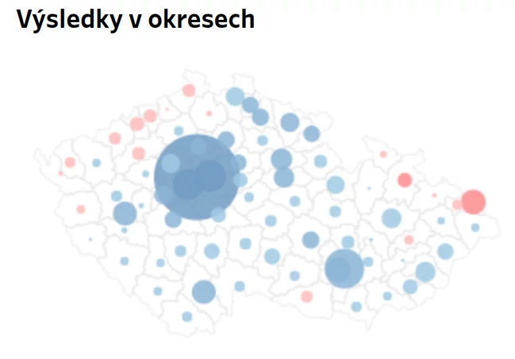

Je 28. 1. 2023 14:27 a Michal Kubal s Marcelou Augustovou právě v České televizi říkají, že v prezidentských volbách jsou sečteny 3,5 % okrsků, 52 tisíc hlasů a s 53 % vede Petr Pavel. Ale je to “zatím malá ochutnávka, která se výrazným způsobem může měnit”. V té chvíli ale už čtenáři Seznam Zpráv vidí [v článku s predikcí výsledků][link_sz], že novým prezidentem se s jistotou více jak 99 % stane Petr Pavel. To bylo možné jen díky otevřených datům!

<!--more-->
### Predikce výsledků

V 14:37 v ČT politolog Jaroslav Bílek říká na otázku, zda už z průběžných výsledků lze něco vykládat: “[Já bych byl stále opatrný, protože křišťálovou kouli jsem nechal doma.][link_jarda]” Ale statisíce uživatelů Seznamu v té době měly už 5 minut na mobilu notifikaci, kdo tyto volby vyhrál. A několik minut poté se totéž dozvěděli také diváci televize CNN Prima na základě predikce agentur STEM a STEM/MARK.



Dlouhá léta bylo sčítání voleb spojeno s grafy Marcely Augustové v České televizi, která komentovala do té doby sečtené výsledky. A tak zpočátku byly výsledky hlavně za malé obce a volební okrsky, které jsou nejrychleji sečteny, čekalo se na to, až začnou chodit výsledky z velkých okrsků ve velkých městech. A mezi tím se experti ve studiu snažili komentovat dosavadní výsledky.

Tahle doba už se nevrátí.

Prezidentské volby ukázaly, že lepší než průběžné výsledky je mít predikci výsledků. A že takové predikce fungují dobře až extrémně dobře. Výsledky lze velmi přesně odhadnout z pár procent sečtených hlasů.

Obecně tyto predikce vycházejí z toho, že jsou dostupná [otevřená data České statistického úřadu z minulých voleb][link_csu] (a to až [na úroveň okrsků][link_csu_nkod]) a lze tak sestavit a otestovat různé modely, které předpovědí konečné výsledky z výsledků průběžných.

Médii proběhl případ [predikce výsledků od firmy Blindspot.ai][link_blindspot]: lidé stojící za otevíráním dat o takovém použití dat mluví dlouhá léta, když argumentují, proč je otevírání dat výhodné: “Zveřejněte data a někdo nečekaně přijde a použije je způsobem, který byste sami nevymysleli.”

A tak zatímco média jsou jasně předpokládaným zpracovatelem otevřených dat o volbách, obtížně bylo tipovat, že dalším uživatelem bude firma, která se jinak zabývá např. efektivním využitím prostoru v dopravních kontejnerech nebo optimalizací přepravních tras.

Zároveň ale uměla použít detailní data poskytovaná ČSÚ o volebních výsledcích a sestrojit velmi přesný predikční model konečných výsledků voleb na základě aktuálně sečtených okrsků. A ať již byla jejich motivace jakákoliv - snaha vyzkoušet si takové modelování, služba pro veřejnost nebo netradiční upoutávka na své služby (a nejspíše mix více věcí) - tato predikce se dostala ať už přímo, přes sociální sítě nebo skrz média ke statisícům lidí.

<figure class="text-center">
    
    <figcaption>Plnění kontejnerů nebo predikce voleb - obojí jsou modely na základě dat počítané v reálném čase. Zdroj: <a href="https://www.youtube.com/watch?v=2H7DXV7B2TU">Video společnosti Blindspot.ai</a></figcaption>
</figure>

A vznikly i další predikce výsledků: [Český rozhlas měl svoji ve spolupráci se statistiky z MFF UK][link_cro]. Před 5 lety zveřejnil [průkopnickou predikci prezidentských voleb Medianu][link_median], letos na ni navázali v rámci [predikce již jako PAQ Research][link_paq].

Se znalostí konečných výsledků lze vidět, že některé byly přesnější než jiné, ale všechny byly velmi dobré a výrazně předčily pouhé průběžné výsledky sčítání. A to vše poháněno otevřenými daty ČSÚ.

### Analýzy
Velmi rychle se objevily také detailní analýzy právě proběhlých voleb. Ještě v ten samý den si mohli lidé prohlížet [detailní výsledky za svoje nebo okolní volební okrsky v mapách][link_sz_mapa]. Také získat přehled, [koho volili voliči neúspěšných kandidátů v prvním kole][link_cro_prechody]. Následující dny tyto mapy a analýzy probublaly dál, třeba i do [tištěných novin][link_hn]. 

ČSÚ nově publikuje i [hranice volebních okrsků jako otevřená data][link_csu_vo]. To také napomohlo tomu, že mapy výsledků či volební účasti se postupně objevily snad ve všech médiích. Stejně tak publikuje hranice volebních okrsků i ČÚZK.

<figure class="text-center">
    
    <figcaption>Kolik hlasů získal vítězný kandidát na svého soupeře v jednotlivých okresech. Právě počty hlasů “navíc” jsou pro výsledek voleb důležité. Zdroj: <a href="https://domaci.hn.cz/c1-67165760-prezidentsky-vykaz-zisku-a-ztrat-prinasime-mapy-vyher-a-porazek-pavla-a-babise-podle-rozdilu-hlasu">Hospodářské noviny</a></figcaption>
</figure>

## Použitá data
Základní kámen pro jakoukoliv prezentaci nebo analýzu volebních výsledků jsou [otevřená data Českého statistického úřadu][link_csu].

Pro jednoduché zobrazování aktuálních výsledků jsou k dispozici data za celou ČR ve formátu XML, ale poté to jde přes kraje, okresy, obce až na detailní úroveň jednotlivých volebních okrsků. Tato poslední úroveň se obvykle používá pro predikce konečných volebních výsledků.

Během večera ještě ČSÚ dodává kompletní výsledky v dalších formátech (pro další strojové zpracování je nejdůležitější CSV, pro ostatní XLS).

## Postup zpracování
Ukážeme zde jednoduchý příklad zpracování právě sčítaných dat z volebních okrsků a výpočet průběžných výsledků. Budeme používat Python s knihovnou Pandas. Data s výsledky z jednotlivých volebních okrsků ČSÚ poskytuje po dávkách, vždy po 5 minutách.

Nejprve je potřeba dostat data ze souborů XML. Na to nám může posloužit [parser, který pro nás napsal ChatGPS][link_parser]. Tím dostaneme data do struktury Dataframe, což je základní datová struktura knihovny Pandas.

A na nejjednodušší výpočet sečtených hlasů z této dávky nám potom stačí doslova pár řádek kódu:

```python
pivot = df.pivot_table(values='HLASY', index=['KSTRANA'], aggfunc=np.sum)
results = pivot.T / pivot.T.sum().sum() * 100
```

Při skutečném použití by samozřejmě toho kódu bylo o něco více, ale tohle je ukázka, že základ je opravdu jednoduchý.

## Výsledek
Díky snadné a rychlé dostupnosti dat a jejich snadnému zpracování se mohou do práce s volebními výsledky zapojovat další - firmy, jednotlivci, školy. 

Volební data jsou tak názornou ukázkou, jak otevřená data demokratizují informace - ještě zhruba před deseti lety měly na poskytování a interpretaci volebních výsledků takřka monopol velká média. Dnes stejné informace umějí zpracovat a předat lidem třeba i studenti střední školy, jak ukazují průkopníci ze [SŠZP Klatovy][link_klatovy].



## Další užití
Prezidentské volby jsou ostře sledované. Média se jim věnují měsíce dopředu. Ale stejné metody a postupy se dají použít i na méně sledované (a o to komplikovanější) volby.

Např. predikce výsledků voleb už byla použita při komunálních volbách 2022 pro [největší města a městské části][link_sz_mesta]. 

Jak připravit [různé mapy výsledků voleb][link_data_mapa] a jak s volebními daty dělat [některé pokročilejší analýzy][link_data_anal] už jsme ukazovali i v těchto článcích.

Je na místě říci, že díky nadprůměrné spolupráci celého ekosystému - od státních sféry zde reprezentované ČSÚ a MVČR přes akademický a neziskový sektor po média a nově již i další firmy - je zpracování volebních výsledků na vysoké úrovni. Takže je tu další možný směr použití získaného know-how směrem za hranice ČR.

## Použité nástroje a zdroje
- [Český statistický úřad][link_csu] - Český statistický úřad: Otevřená data pro volební výsledky
- [Český úřad zeměměřičský a katastrální][link_cuzk] - RÚIAN speciální data - volební okrsky - stát
- [Python][link_python] + [Pandas][link_pandas] - open source a zdarma


[link_python]: https://www.python.org/ "Programovací jazyk Python"
[link_pandas]: https://pandas.pydata.org/ "Knihovna Pandas"
[link_data_anal]: https://data.gov.cz/%C4%8Dl%C3%A1nky/volebn%C3%AD-mapa-%C4%8Dr-volby-2021 "Volební mapa ČR - volby 2021"
[link_data_mapa]: https://data.gov.cz/%C4%8Dl%C3%A1nky/mapa-s-v%C3%BDsledky-voleb-po-okrsc%C3%ADch "Mapa s výsledky voleb po okrscích"
[link_sz_mesta]: https://www.seznamzpravy.cz/clanek/volby-komunalni-necekejte-do-noci-vime-kdo-bude-vladnout-v-nejvetsich-mestech-215169 "Praha po nočním sečtení hlasů: Vyhrálo Spolu, SPD v zastupitelstvu"
[link_klatovy]: https://volby.maleskoly.info/ "On-line zpracování volebních výsledků, živé vstupy"
[link_parser]: https://sharegpt.com/c/ners9go "ChatGPS: Parser XML volebních výsledků"
[link_cuzk]: https://data.gov.cz/datov%C3%A1-sada?iri=https%3A%2F%2Fdata.gov.cz%2Fzdroj%2Fdatov%C3%A9-sady%2F00025712%2F885a03d4d6fe73adda96ba9b822680b7 "Národní katalog otevřených dat: RÚIAN speciální data - volební okrsky - stát"
[link_csu_vo]: https://data.gov.cz/datov%C3%A1-sada?iri=https%3A%2F%2Fdata.gov.cz%2Fzdroj%2Fdatov%C3%A9-sady%2F00025593%2F4855a3771ba52691a3d0dd25d0caa35e "Národní katalog otevřených dat: Hranice volebních okrsků 2022"
[link_hn]: https://pbs.twimg.com/media/FntMHxwXEAEd1U-?format=jpg&name=large "HN: výsledky voleb 2023"
[link_cro_prechody]: https://shielded.irozhlas.cz/volby/prelivy-volicu-prezidentske-volby-andrej-babis-petr-pavel-analyza_2301281930_pek "Pavel si jádro voličů z 1. kola udržel. Od Babiše se na 400 tisíc podporovatelů ve finále odvrátilo"
[link_sz_mapa]: https://www.seznamzpravy.cz/clanek/volby-prezidentske-prezidentska-mapa-2023-jak-volili-vasi-sousede-224676 "Prezidentská mapa 2023: Jak volili vaši sousedé"
[link_paq]: https://www.paqresearch.cz/post/predikce-druhe-kolo "Kdo bude prezidentem? PAQ predikuje z průběžných výsledků"
[link_median]: http://showme.median.cz/volby-2018/ "Predikce prezidentských voleb 2018"
[link_cro]: https://www.irozhlas.cz/volby/prezidentske-volby-2023/predikce "Predikce prezidentských voleb"
[link_blindspot]: https://volby.blindspot.ai/ "Předpověd výsledků 2. kola volby prezidenta ČR pomocí umělé inteligence"
[link_csu_nkod]: https://data.gov.cz/datov%C3%A1-sada?iri=https%3A%2F%2Fdata.gov.cz%2Fzdroj%2Fdatov%C3%A9-sady%2F00025593%2F5599a961f577a0f353084f293fe5947b "Národní katalog otevřených dat: Otevřená data pro volební výsledky"
[link_csu]: https://www.volby.cz/opendata/opendata.htm "Otevřená data pro volební výsledky"
[link_stem]: https://cnn.iprima.cz/predikce-cnn-prima-news-znovu-vysla-presne-predpovedela-vitezstvi-petra-pavla-199274 "Predikce CNN Prima NEWS znovu vyšla. Přesně předpověděla vítězství Petra Pavla"
[link_sz]: https://www.seznamzpravy.cz/p/vysledky-voleb/2023/prezidentske-volby/kolo/2/predikce-odhad "Predikce výsledků prezidentských voleb 2023"
[link_jarda]: https://www.ceskatelevize.cz/porady/15496675472-prezidentske-volby/223411033290004/ "Česká televize: Volební studio 14:00" 
