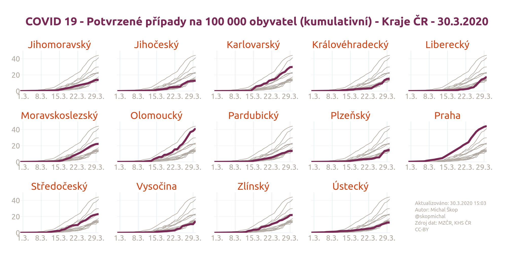

Zobrazení vývoje počtu potvrzených nakažených lidí Covid-19 v krajích ČR s použitím otevřených dat z krajských hygienických stanic.

<!--more-->
## Úvod
Ministerstvo zdravotnictví ČR začalo 27.3.2020 zveřejňovat na svém [dashboardu][link_opendata_covid19] dlouho očekávaná otevřená data z krajských hygienických stanic o onemocnění způsobených virem Covid-19.

Použijeme je na vytvoření grafu průběhu počtu potvrzených osob s nákazou virem Covid-19. Tentokrát použijeme Python. Cílem je vytvořit tento graf (inspirovaný grafy z [Financial Times][link_ft]):


## Data
- Soubor `CSV` _COVID-19: Přehled osob s prokázanou nákazou dle hlášení krajských hygienických stanic_, který je dostupný na [dashbordu Covid-19 MZČR][link_opendata_covid19]. Konkrétně jde o [tento soubor][link_osoby_csv].
- Na základní informace o krajích (potřebujeme _počet lidí_ a _kód NUTS kraje_) by bylo dobré použít poslední data z ČSÚ, ale s ohledem na malý rozsah můžeme vzít data z Wikipedie o [krajích ČR][link_wikipedia_kraje_v_cesku] a [kódech NUTS][link_wikipedia_cz_nuts]. A nakopírujeme je dohromady do jednoho souboru [`cz_regions.csv`][link_cz_regions_csv].


## Postup
### Příprava dat
Cílem této části je připravit kumulativní data potvrzených nakažených do _CSV_ tabulky tak, aby se snáze dělal graf. Tj. aby byla informace o počtu pro každý den a každý kraj (přesto, že ve zdrojových datech třeba takový údaj - kombinace určité datum a určitý kraj - není, protože tam bylo 0 nových případů).

Tabulka bude vypadat takto:

| date | code | value |
| --- | --- | ---: |
| 2020-02-29 | CZ010 | 2 |
| 2020-02-29 | CZ020 | 0 |
| ... | ... | ... |

Použijeme [Python][link_python] (verzi 3) a knihovnu [Pandas][link_pandas].

Nejprve naimportujeme potřebné knihovny a nastavíme si náš pracovní adresář (nastavte si tam vlastní):

```python
import csv
import datetime
import pandas

path = "NÁŠ_PRACOVNÍ_ADRESÁŘ"
```

Stáhneme aktuální data:

```python
url = "https://onemocneni-aktualne.mzcr.cz/api/v1/covid-19/osoby.csv"
source_data = pandas.io.parsers.read_csv(url)
```

Bezpochyby existuje i elegantnější řešení, ale tohle je také funkční:
- Vytvoříme si _kontingenční tabulku_ (`grouped_data`) ze zdrojových dat.
- Poté ji spojíme s tabulkou (`full_zero_data`), kde jsou všechna data (myšleno dny, např. _2020-02-29_) a všechny kraje - a dostaneme tabulku hodnot počtů případů v daném dni, kde jsou ale již i nulové hodnoty.
- Postupně nasčítáme kumulativně hodnoty (`cumulative_data`) a uložíme je do `cz_regions_infected.csv`

```python
# pivot table from source data
grouped_data = source_data.groupby(['datum_hlaseni', 'kraj'])['datum_hlaseni'].count().reset_index(name='value')

# dates
first_day = datetime.datetime.strptime(grouped_data.min()['datum_hlaseni'], "%Y-%m-%d")
last_day = datetime.datetime.strptime(grouped_data.max()['datum_hlaseni'], "%Y-%m-%d")
difference = last_day - first_day

# full table with all dates and all regions
full_zero_data = pandas.DataFrame(columns=grouped_data.columns)
codes = grouped_data['kraj'].unique()
for i in range(0, difference.days + 1):
    this_day = first_day + datetime.timedelta(i)
    for code in codes:
        item = {
            'datum_hlaseni': datetime.datetime.strftime(this_day, "%Y-%m-%d"),
            'kraj': code
        }
        full_zero_data = full_zero_data.append(item, ignore_index=True)

# join the tables -> all dates and regions with values
full_grouped_data = pandas.merge(full_zero_data, grouped_data, how='left', on=['datum_hlaseni', 'kraj'])
full_grouped_data.fillna(0, inplace=True)
full_grouped_data = full_grouped_data.drop(['value_x'], axis=1)
full_grouped_data.columns = grouped_data.columns

# cumulative data
cumulative_data = {}
header = ['date', 'code', 'value']
with open(path + "cz_regions_infected.csv", "w") as fout:
    dr = csv.DictWriter(fout, header)
    dr.writeheader()
    for index, row in full_grouped_data.iterrows():
        this_day = datetime.datetime.strptime(row['datum_hlaseni'], "%Y-%m-%d")
        this_yesterday = this_day - datetime.timedelta(1)
        this_yesterday_text = datetime.datetime.strftime(this_yesterday, "%Y-%m-%d")
        try:
            last = cumulative_data[this_yesterday_text][row['kraj']]
        except Exception:
            last = 0
        if row['datum_hlaseni'] not in cumulative_data.keys():
            cumulative_data[row['datum_hlaseni']] = {}
        cumulative_data[row['datum_hlaseni']][row['kraj']] = last + int(row['value'])
        item = {
            'date': row['datum_hlaseni'],
            'code': row['kraj'],
            'value': cumulative_data[row['datum_hlaseni']][row['kraj']]
        }
        dr.writerow(item)
```

[Celý soubor s přípravou dat v pythonu][link_cz_prepare_data_mzcr_py] a výsledný soubor [`cz_regions_infected.csv`][link_cz_regions_infected_csv]

### Kreslení grafu
Na kreslení grafu použijeme opět [Python][link_python] s [Pandas][link_pandas] a na samotné kreslení knihovnu [Plotly][link_plotly].

Načteme si data, spojíme je do tabulky, připravíme série za jednotlivé kraje a najdeme maximum za všechny hodnoty.

```python
import datetime
import math
import pandas
import plotly.subplots as subplots
import plotly.graph_objects as go

path = "NÁŠ_PRACOVNÍ_ADRESÁŘ"

# read data
infected = pandas.read_csv(path + "cz_regions_infected.csv")
basic_info = pandas.read_csv(path + 'cz_regions.csv')
data = pandas.merge(infected, basic_info, on='code')
names = sorted(basic_info["name"].tolist())
series = []
for name in names:
    series.append(data[(data['name'] == name)])
dates = []
for row in series[0]['date']:
    date = datetime.datetime.strptime(row, "%Y-%m-%d")
    dates.append(date)

# y max value for chart
data['value_per_capita'] = data['value'] / data['population']
y_max = math.ceil(max(data['value_per_capita']) * 10000) * 10
```

Aby graf byl hezčí, použijeme nějakou připravenou paletu barev, já používám [United z Bootswatch][link_bootswatch]:

```python
# colors from https://bootswatch.com/united/
colors = {
    'primary': '#ce4414',
    'secondary': '#9c948a',
    'success': '#2f973e',
    'info': '#138496',
    'warning': '#ecaa1b',
    'danger': '#c7291e',
    'dark': '#772953',
    'light': '#e9ecef',
    'text-light': 'rgba(0, 0, 0, 0.9)',
    'text-dark': '#fff',
    'text-muted': '#868e96',
    'text-primary': '#E95420',
    'text-secondary': '#AEA79F',
    'text-warning': '#EFB73E',
    'text-danger': '#DF382C',
    'text-success': '#38B44A',
    'text-info': '#17a2b8'
}
```

Nastavíme základní matici malých grafů (máme 14 krajů, takže 3x5 bude ok).

```python
dims = [3, 5]
fig = subplots.make_subplots(dims[0], dims[1], shared_yaxes=True, subplot_titles=names)
```

Nakreslíme jednotlivé malé grafy, včetně úprav os:

```python
i = 1
j = 1
for s in series:
    # gray lines of other regions
    for ss in series:
        traceg = go.Scatter(
            x=dates,
            y=(ss['value'] / ss['population'] * 100000).tolist(),
            name=ss['name'].tolist()[0],
            mode='lines',
            line={
                'color': colors['text-secondary'],
                'width': 2
            }
        )
        fig.add_trace(traceg, row=i, col=j)
    # main colourful line of the region
    trace = go.Scatter(
        x=dates,
        y=(s['value'] / s['population'] * 100000).tolist(),
        name=s['name'].tolist()[0],
        mode='lines',
        line={
            'color': colors['dark'],
            'width': 8
        }
    )
    fig.add_trace(trace, row=i, col=j)
    # y axis
    fig.update_yaxes(
        range=[0, y_max],
        color=colors['text-secondary'],
        tickfont={'size': 30},
        gridwidth=1,
        gridcolor=colors['light'],
        row=i,
        col=j
    )
    # x axis
    fig.update_xaxes(
        tickformat="%-d.%-m.",
        color=colors['text-secondary'],
        tickfont={'size': 30},
        nticks=5,
        gridwidth=2,
        gridcolor=colors['light'],
    )
    j += 1
    if j == (dims[1] + 1):
        j = 1
        i += 1
```

Nastavíme _layout_ grafu a nadpisy.

```python
# layout settings, title
fig.update_layout(
    height=1500,
    width=2000,
    showlegend=False,
    margin={
        't': 200
    },
    title={
        'font': {
            'size': 45,
            'color': colors['dark']
        },
        'text': "<b>Covid 19 - Potvrzené případy na 100 000 obyvatel (kumulativní) - Kraje ČR - " + datetime.date.today().strftime("%-d.%-m.%Y") + "</b>"
    },
    font={"family": "Ubuntu", "color": colors['primary']},
    template="plotly_white"
)
fig.update_annotations(
    font={'size': 40}
)
```

Do prázdného místa 15. malého grafu přidáme _credit_:

```python
credit = go.layout.Annotation(
    text='Aktualizováno: ' + datetime.date.today().strftime("%-d.%-m.%Y") + '<br>Autor: Michal Škop<br>@skopmichal<br>Zdroj dat: MZČR, KHS ČR<br>CC-BY',
    align='left',
    font={'size': 20, 'color': colors['text-secondary']},
    showarrow=False,
    xref='paper',
    yref='paper',
    x=1,
    y=0
)
fig.add_annotation(credit)
```

Graf uložíme do souboru `cz_regions.png` a `cz_regions.svg`.

```python
fig.write_image(path + "cz_regions.png")
fig.write_image(path + "cz_regions.svg")
```

Pro obecné použití jsme použili rozměr 4x3. Např. pro Twitter je ale lepší 2:1.

```python
# Different size optimized for Twitter
fig.update_layout(
    height=1000,
    width=2000
)
fig.write_image(path + "cz_regions_twitter.png")
```

[Celý soubor s kreslením grafu v pythonu][link_cz_matrix_chart_py].

## Výsledek

Výsledný graf s poměrem stran 2:1 (např. pro Twitter):




- [Výsledný graf 4:3 PNG][link_chart_png]
- [Výsledný graf 4:3 SVG][link_chart_svg]
- [Výsledný graf 2:1 PNG][link_chart_twitter_png]
- [Zdrojový soubor s přípravou dat v pythonu][link_cz_prepare_data_mzcr_py]
- [Zdrojový soubor s kreslením grafu v pythonu][link_cz_matrix_chart_py]


## Použité nástroje
- [Python 3][link_python] - programovací jazyk, _open source a zdarma_
- [Pandas][link_pandas] - knihovna pro operaci s daty, _open source a zdarma_
- [Plotly][link_plotly] - knihovna pro kreslení grafů, _open source a zdarma_
- [Bootswatch][link_bootswatch] - _themes_ pro Bootstrap, _open source a zdarma_

[link_opendata_covid19]: https://onemocneni-aktualne.mzcr.cz/api/v1/covid-19 "Otevřená data MZČR/KHS o Covid-19"
[link_osoby_csv]: https://onemocneni-aktualne.mzcr.cz/api/v1/covid-19/osoby.csv "Soubor `CSV` COVID-19: Přehled osob s prokázanou nákazou dle hlášení krajských hygienických stanic"
[link_wikipedia_kraje_v_cesku]: https://cs.wikipedia.org/wiki/Kraje_v_Česku "Wikipedia: Kraje v Česku"
[link_wikipedia_cz_nuts]: https://cs.wikipedia.org/wiki/CZ-NUTS "Wikipedia: CZ-NUTS"
[link_cz_regions_csv]: ./cz_regions.csv "Základní info o krajích ČR v _CSV_"
[link_ft]: https://www.ft.com/coronavirus-latest "Coronavirus tracked: the latest figures as the pandemic spreads"
[link_python]: https://www.python.org/ "Python"
[link_pandas]: https://pandas.pydata.org/ "Pandas"
[link_cz_prepare_data_mzcr_py]: ./cz_prepare_data_mzcr.py "Příprava dat v Pythonu"
[link_cz_matrix_chart_py]: ./cz_matrix_chart.py" "Vykreslení grafu v Pythonu"
[link_cz_regions_infected_csv]: ./cz_regions_infected.csv "Kumulativní počty nakažených po krajích v _CSV_"
[link_plotly]: https://plotly.com/python/ "Plotly"
[link_bootswatch]: https://bootswatch.com/ "Bootswatch"
[link_chart_png]: ../images/cz_regions.png "Výsledný graf 4:3 PNG"
[link_chart_svg]: ../images/cz_regions.svg "Výsledný graf 4:3 SVG"
[link_chart_twitter_png]: ../images/cz_regions_twitter.png "Výsledný graf 2:1 PNG"
