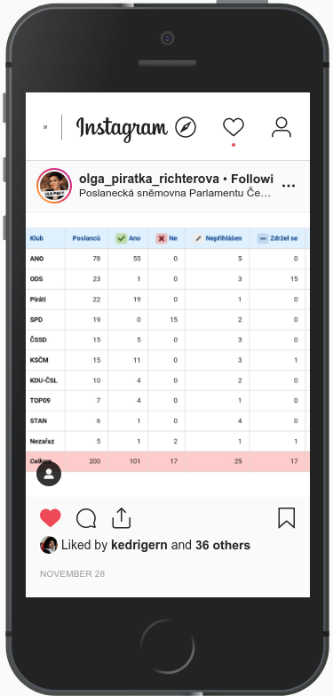
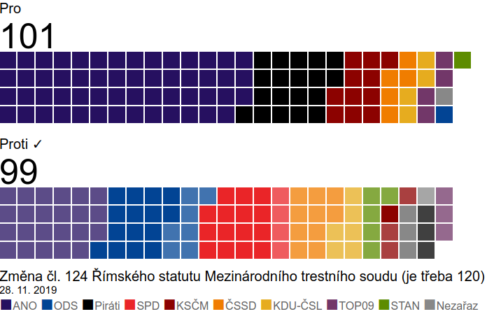
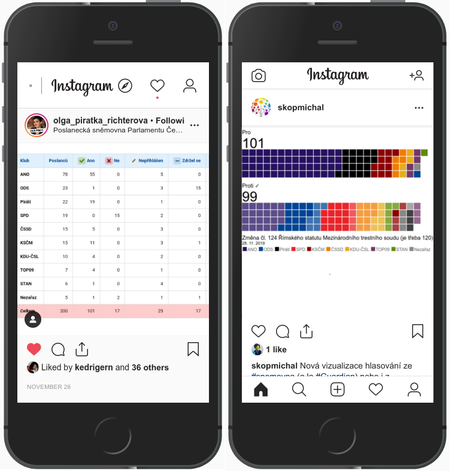

_Rychlý odkaz: <a href="https://michalskop.gitlab.io/votings_vue/" target="_blank">Demo aplikace</a>_

Poslankyně Olga Richterová [dala na Instagram obrázek tabulky výsledku hlasování](https://www.instagram.com/p/B5aGaDDnnQX/). Je to tabulka, která je _vlevo dole_ u každého hlasování v Poslanecké sněmovně (konkrétně toto hlasování je [zde](http://www.psp.cz/sqw/hlasy.sqw?g=71631&l=cz)).



Ovšem ukázat _hezky přehledně_ výsledek hlasování je docela užitečná věc nejen pro poslankyni. Může to být pro novináře ze Sněmovny, může to být na obci, může to být prostě leckde.

Abychom neměli jenom takovou tabulku (i když díky i za ní), koukneme, jak to dělají ti nejlepší a zkusíme uvařit zobrazení výsledků hlasování podle [Guardianu](https://www.theguardian.com/politics/ng-interactive/2019/mar/12/how-did-your-mp-vote-in-the-march-brexit-votes). Naším cílem bude vytvořit obrázek pro Instagram, na Facebook, na Twitter.

Naším cílem bude takovýto obrázek:



## Data
### Běžně dostupné suroviny
- [Otevřená formální norma Hlasování](https://ofn.gov.cz/hlasování/draft/)
- [Otevřená data z hlasování z Národního katalogu otevřených dat](https://data.gov.cz/datov%C3%A9-sady?dotaz=Hlasov%C3%A1n%C3%AD%20zastupitelstva)

### Suroviny, které musíme trochu hledat
- [Hlasování a otevřená data ze Sněmovny](http://www.psp.cz/sqw/hp.sqw?k=1300)
- [Barvy pro politické strany](https://github.com/michalskop/political_parties/blob/master/cz/parties.csv)
- [Některá starší hlasování z obcí](https://hlasovali.cz)

## Postup
### Příprava dat - standardizace
V katalogu otevřených dat zjistíte, že zas tak moc těch hlasování tam není. A už vůbec ne aktuálních. Ale spousta - alespoň těch větších - obcí dneska ta data má z hlasovacího zařízení, jenom je nedává jako otevřená ven. Takže pokud vás zajímá nějaká konkrétní obec, zkuste to napřímo se zeptat na radnici (nebo třeba pomocí [formuláře přes infozákon](https://infoprovsechny.cz) ).

Pokud se ale koukneme na to, co máme k dispozici - starší Prahu 6, Hradec Králové, Děčín z Katalogu otevřených dat nebo další odjinud (Sněmovnu, z Hlasovali.cz) - viďíme, že všechna ta hlasování mají zcela jiný formát. Takže prvně si je převedeme do jednotného formátu, abychom je mohli snadno použít.

Použijeme část [této části otevřené formální normy](https://ofn.gov.cz/parlamentn%C3%AD-data/draft/#t%C5%99%C3%ADda-hlasov%C3%A1n%C3%AD), ale budeme si muset k tomu ještě dodat pár věcí - barvu strany, aby graf byl co nejpřehlednější, nebo `requirement`, tj. jak se výsledek hlasování počítá. Taky si u stran přidáme `abbreviation`, tedy zkratku strany kvůli legendě. Náš soubor by měl nakonce vypadat takto v JSONu:
```JSON
{
    "motion": {
        "name": "Prodej budovy základní školy "
    },
    "end_date": "2015-12-09",
    "requirement": "Nadpoloviční většina všech členů",
    "voters": [
        {
            "voter": {
                "name": "Škop Petr"
            },
            "group": {
                "name": "Nezávislí pro Plasko",
                "abbreviation": "NzP",
                "color": "#a7f63d"
            },
            "option": "no"
        },
        ... atd. (další zastupitelé nebo poslanci) ...
    ]
}
```

Tohle je trochu otravná práce, tak pro inspiraci, jak se na to dá jít:
- Praha 6: nejprve si z open dat v XML udělat [seznam zastupitelů](readme/praha6/praha6_list.csv) a ručně doplnit strany (v těch XML nejsou), potom z vybraného hlasování se udělá [tabulka](readme/praha6/praha6_ve.csv) a z tabulky (a z tabulky [barev stran](readme/praha6/parties.csv)) už [výsledný JSON](readme/praha6/praha6.csv)
- Brno, Brno-střed nebo Plasy: tato data jsou z [hlasovali.cz](https://hlasovali.cz), kde jsou v tabulce (nakopíruje se to z webu do tabulky a doplní hlavička, např. [Brno](readme/brno_plasy/brno.csv)). A to se potom (pomocí [skriptu](readme/brno_plasy/csv2json.py) převede to [výsledného JSONu](readme/brno_plasy/brno.json))
- Sněmovna je trochu složitější. Nejprve [stáhneme a rozbalíme data](readme/psp/downloader.py), potom [vytáhneme hlasy](readme/psp/downloader.py). Trochu si ušetříme práci tím, že info o aktuálních poslancích si stáhneme z [Napište jim!](https://napistejim.cz). Potom si [vytvoříme datapackage](readme/psp/create_datapackage.py). A nakonec zase pomocí [posledního skriptu](readme/psp/create_json.py) dostaneme kýžený [JSON]("readme/psp/psp.json"). Nesmíme zapomenout taky správně nastavit `requirement`, který může být ve Sněmovně různý (ústavní hlasování, běžné, atd.)

### Grafy, obrázky
Grafy si vytvoříme pomocí Vue.js v SVG. V takovém případě se vcelku automaticky nabízí použít [D3.js](https://d3js.org/), ale tady chceme jenom čtverečky a zvládnem to i přímo v Javascriptu s pomocí toho Vue.js, D3 by tady byl zbytečný overkill.

Nejprve si [přetrasformujeme data, jak potřebujeme](src/components/Wrapper.vue) (na 2 až 3 skupiny). A tuty přetransformovaný data [vykreslíme do SVG](src/components/Grid.vue)

Tohle rozdělení na 2 kroky je dobré proto, že ze stejných přetransformovaných dat můžeme snadno udělat ještě další graf:


Můžeme také využít reaktivity Vue.js a vytvořit si [CELOU MINIAPLIKACI](https://michalskop.gitlab.io/votings_vue/). Můžeme si tam snadno měnit velikosti všecho na grafu a taky měnit rovnou i samotná data.

Do ní ještě zabudujeme tlačítko, které pomocí Canvg vygeneruje z vektorového SVG obrázek-bitmapu v PNG. A můžeme ho konečně dát na všechny sociální sítě ❤.

## Výsledek

A závěrečné srovnání - stejné ústavní hlasování, kde byla potřeba 120 hlasů, vlevo pomocí tabulky z webu Sněmovny, vpravo co jsme z toho ukuchtili:



(A jen poznámka na závěr: `zdržet se` má na výsledek hlasování úplně stejný vliv jako `hlasovat ne`. U takovýchto ústavních hlasování dokonce i neučást je stejná jako `ne` - není to prostě `podpora návrhu`)

## Další užití

Obdobně lze vyzualizovat nejrůznější hlasování: z jiných parlamentů, ze zastupitelstev, apod. Jako např. zde ze _zastupitelstva města Plasy_:


## Použité nástroje a zdroje
(ale jde to mnoha způsoby, záleží, s čím jsem zvyklí dělat)
- [Vue.js](ttps://vuejs.org/v2/guide/) - v tom budeme vařit - _open source a zdarma_
- [Canvg](https://github.com/canvg/canvg) - na vykouzlení konečných obrázků - _open source a zdarma_
- [Python](https://docs.python.org/3/) - pomocí toho si zpracováváme ta surová data - _open source a zdarma_
- [Výsledná miniaplikace](src/) - _open source a zdarma_

## Autor
Michal Škop

únor 2020
