

Zúčastněte se 9. ročníku konference **Jak na data ve veřejné správě** o využívání a správě dat státní správy a samosprávy!

## [Sledujte online přenos](https://www.youtube.com/watch?v=QsRbYAd6MuM)
## [Ptejte se přes sli.do - #data2025](https://app.sli.do/event/wZxckbRvmkrsRcy6c5p3WX)

- **Kdy?** 3. června 2025, 9:00 - 16:00
- **Kde?** Akademie veřejného investování MMR, Pařížská 4, 110 00 Praha a online
- **Registrace:** Registrace jsou již uzavřené. Kapacita sálu je naplněna. Konferenci můžete sledovat online na YouTube!

Veřejná správa disponuje velkým potenciálem v podobě datových zdrojů, které spravuje. 
Pro jejich efektivní využití je však nutné do této oblasti systematicky investovat - nejen finance, ale i čas a úsilí. 
Klíčová je podpora kvality dat, propracovaného data managementu a v neposlední řadě také do vzdělávání úředníků i dalších zainteresovaných stran. Letošní konference se zaměří na efektivní správu dat, jejich sdílení, zajištění vysoké datové kvality a konkrétních příkladů užití dat a to nejen otevřených.

## Program

* 08:30 - 09:00 **REGISTRACE**

* 09:00 - 10:05 **ÚVODNÍ BLOK - TRENDY V DATECH VEŘEJNÉHO SEKTORU**
  * **Zahájení konference a úvodní slovo** Martin Mesršmíd, Digitální a informační agentura
  * **Keynote speech: The Danish public sector approach to data availability – lessons learned from the National Data Portal and key tasks for the coming years (in English)** Martin Skovbjerg Jensen, Dánská agentura pro digitální vládnutí - Keynote speech will be focused on the approach taken by the Danish Data Portal (www.datavejviser.dk), and how this builds upon and interacts with a range of other investments in the quality and availability of public sector data.
  * **Keynote speech: Role AI ve správě dat** Martin Nečaský, Matematicko-fyzikální fakulta UK

* 10:05 - 11:45 **BLOK I - SPRÁVA DAT**
  * **Naplňování minimálního standardu a jak si stojíme** Libor Drlík, Digitální a informační agentura
  * **Geoportál ČR - jednotný přístup k prostorovým  datům** Jitka Faugnerová, CENIA
  * **Archivní data jako národní kapitál: umíme využít jejich potenciál?** Zbyšek Stodůlka, Národní archiv
  * **Datové standardy - tvorba Záznamu informačního systému nahrazujícího úředně ověřený podpis** Martin Cepr, Digitální a informační agentura
  * **Integrovaný systém řízení ÚPV – cesta nejen ke kvalitní správě dat** Michal Verner, Úřad průmyslového vlastnictví
  * **European Health Data Space – nový evropský prostor pro sdílení zdravotnických dat jako výzva** Klára Jiráková, Kraj Vysočina/Ministerstvo zdravotnictví - NCEZ

* 11:45 - 12:30 **OBĚD**

* 12:30 - 14:00 **BLOK II - VEŘEJNÁ DATA A VĚDA**               
  * **Řízený přístup k datům** David Hemala, Digitální a informační agentura
  * **Kde je rovnováha mezi benefity a riziky využití zdravotnických dat** Aleš Tichopád, Fakultě biomedicínského inženýrství ČVUT
  * **EOSC a rozvoj národní infrastruktury pro výzkumná data v České republice** Jiří Marek, European Open Science Cloud - Masarykova univerzita
  * **Využití veřejných dat pro výzkumné účely z perspektivy uživatele** Radim Hladík, Akademie věd ČR
  * **Víme, kam vaše děti chodí do školy. Možnosti a limity dat s vysokým rozlišením.** Jiří Münich, PAQ Research

* 14:00 - 14:30 **COFFEE BREAK**

* 14:30 - 16:00 **BLOK III - OTEVŘENÁ DATA A JEJICH VYUŽITÍ**
  * **Zastupko.cz: transparentnost v rozhodování samospráv** Kristýna Zaklová, Zastupko
  * **Otevřené zprávy: jak vypadá cesta datové sady do článku v povodních nebo do investigativní reportáže?** Jan Cibulka, Český rozhlas
  * **Jaká data o životním prostředí máme dnes volně k dispozici, co s nimi můžeme dělat a k čemu nám jsou?** Jáchym Brzezina, Envidata
  * **Mapa exekucí - Jak data pomohla při řešení velkého sociálního problému** Radek Hábl, Institut prevence a řešení předlužení
  * **Když chcete grafem něco říct** Kristína Pšorn Zákopčanová

WORKSHOPY (workshopy nebudou přenášeny online!):
* 10:05 - 10:45 **WORKSHOP - Vizualizace dat** Martin Smetana, Václav Flaška, Kristýna Pulpán, Nejvyšší kontrolní úřad - pro velký úspěch jde o opakování workshopu z roku 2024
* 12:30 - 13:15 **DISCUSSION with Martin Skovbjerg Jensen of the Danish Agency for Digital Government (in English)**
Chance to further compare and share experiences between the Czech Republic and Denmark. Themes of interest include lessons learned on how to map and describe public sector data that could be shared, which types of information about datasets are most useful to potential data users, and how one prioritises what data should be made more openly available.                  

**KAPACITA WORKSHOPŮ JE JIŽ NAPLNĚNA!** 

## Na konferenci vystoupí
<gov-grid gutter-x="1rem" gutter-y="1rem">
    <gov-grid-item size-sm="12/12" size-md="6/12" size-lg="4/12" size-xl="3/12">
      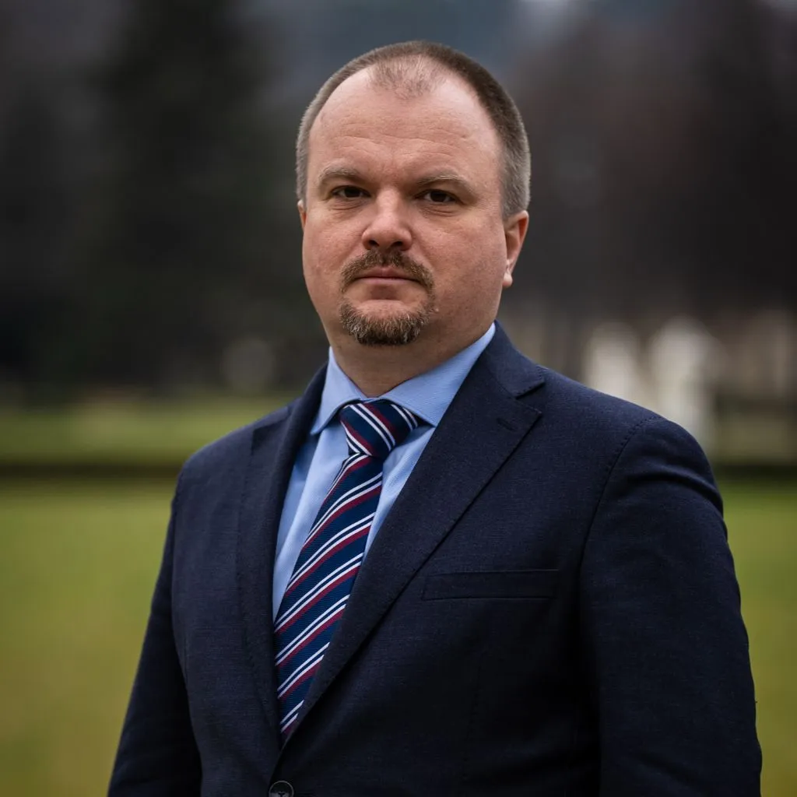
    </gov-grid-item>
    <gov-grid-item size-sm="12/12" size-md="6/12" size-lg="8/12" size-xl="9/12">
      

        <strong>Martin Mesršmíd</strong> vystudoval informační management na pražské Vysoké škole ekonomické. Mezi roky 2005 a 2010 působil v Seznam.cz, kde měl jako manažer na starosti portál Sprace.cz, zaměřený na pracovní příležitosti. Od září 2010 do května 2013 pracoval v Economii, kde řídil oddělení zodpovědné za elektronickou distribuci obsahu. Od června 2013 pracoval zejména pro Avast, zhruba rok se věnoval vedení týmu zaměřeného na zkoumání dat, poté vystřídal několik pozic v divizi Jumpshot. Od 1.2. 2023 je ředitelem Digitální a informační agentury.
      

    </gov-grid-item>
</gov-grid>

<gov-grid gutter-x="1rem" gutter-y="1rem">
    <gov-grid-item size-sm="12/12" size-md="6/12" size-lg="4/12" size-xl="3/12">
      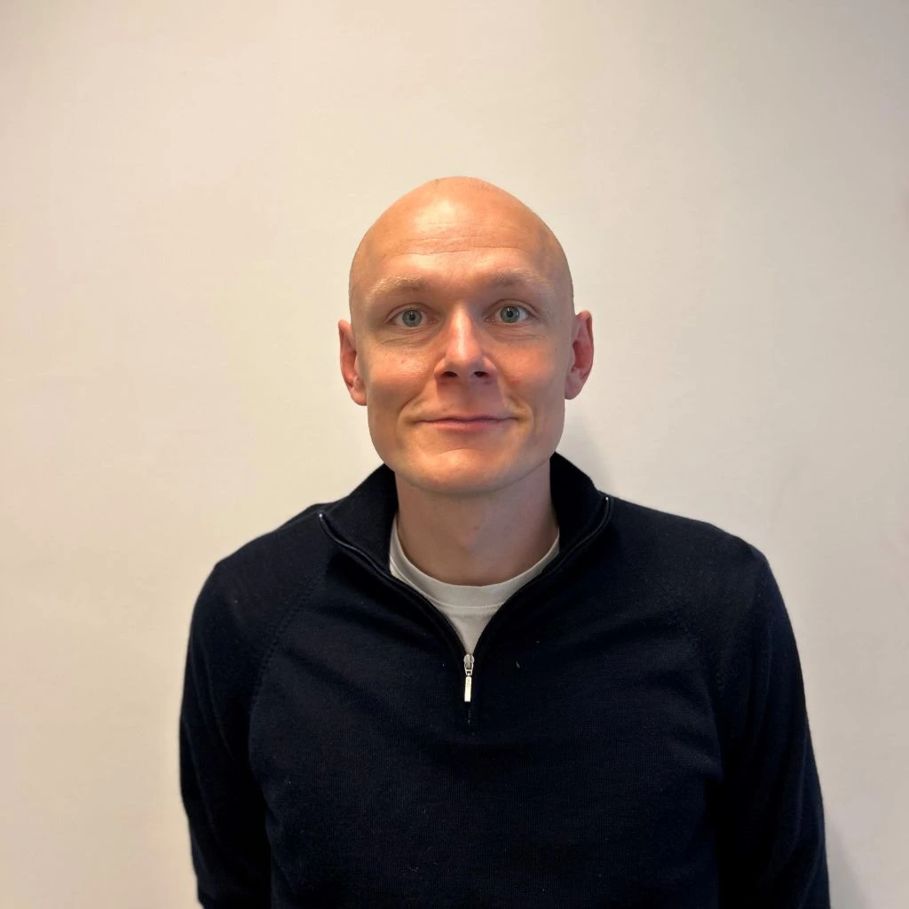
    </gov-grid-item>
    <gov-grid-item size-sm="12/12" size-md="6/12" size-lg="8/12" size-xl="9/12">
      

        <strong>Martin Skovbjerg Jensen</strong> has been working at the Agency for Digital Government since 2017. Martin has been the project lead on Datavejviser.dk for the last few years. He and his colleagues work to make finding, assessing and re-using data from the public sector easier. Martin also works on data strategy and standardisation issues from a public sector perspective. 
      

    </gov-grid-item>
</gov-grid>

<gov-grid gutter-x="1rem" gutter-y="1rem">
    <gov-grid-item size-sm="12/12" size-md="6/12" size-lg="4/12" size-xl="3/12">
      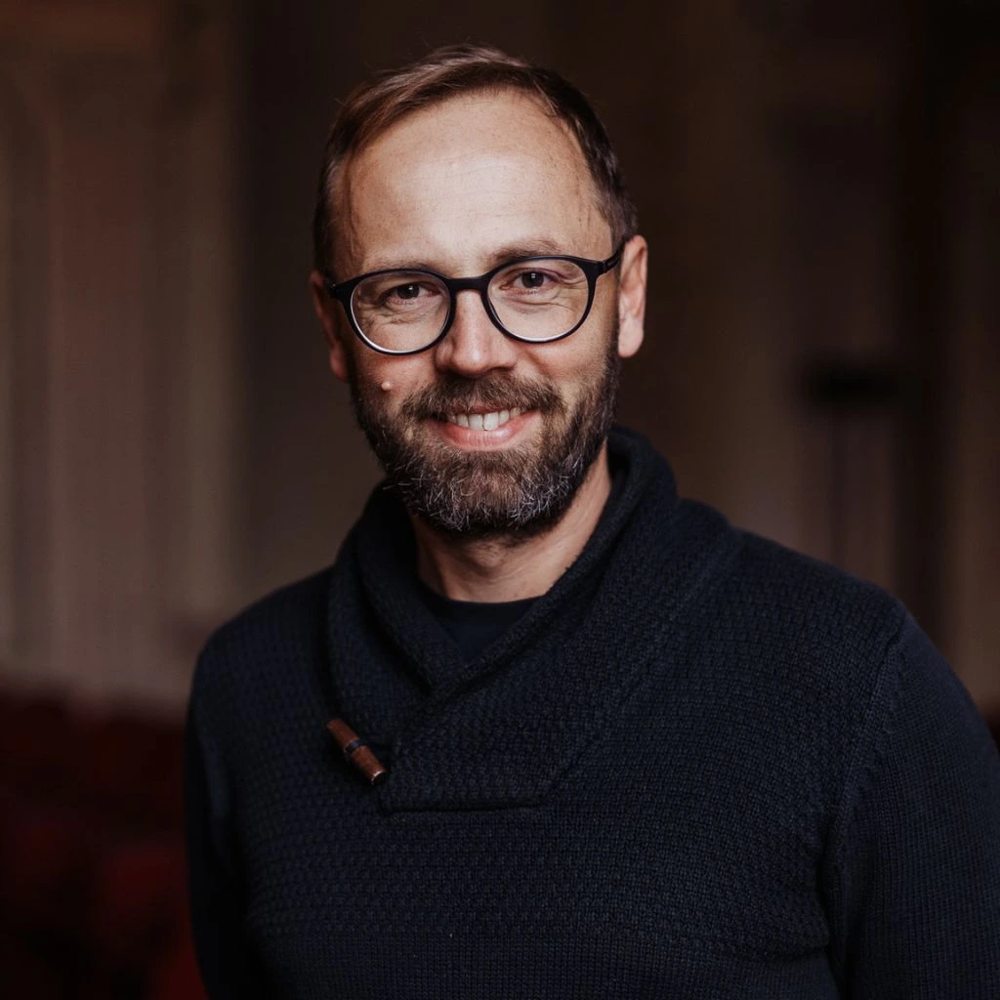
    </gov-grid-item>
    <gov-grid-item size-sm="12/12" size-md="6/12" size-lg="8/12" size-xl="9/12">
      

        <strong>Martin Nečaský</strong> působí v oblasti dat veřejné správy od roku 2011, kdy založil iniciativu OpenData.cz. Od té doby realizoval řadu projektů, ve kterých pomáhal úřadům s otevíráním jejich dat (např. ČTÚ, ČSSZ, MFČR, NKÚ, MV ČR). V současnosti působí jako docent a vedoucí Katedry softwarového inženýrství na Matematicko-fyzikální fakultě Univerzity Karlovy v oboru softwarového a datového inženýrství. V letech 2015 - 2023 vedl odborný tým Národního koordinátora otevřených dat na Ministerstvu vnitra ČR. Od roku 2024 působí jako expert a poradce pro správu dat na Digitální informační agentuře. Publikuje v uznávaných mezinárodních vědeckých časopisech, jako je např. Semantic Web Journal nebo Journal of Web Semantics.
      

    </gov-grid-item>
</gov-grid>

<gov-grid gutter-x="1rem" gutter-y="1rem">
    <gov-grid-item size-sm="12/12" size-md="6/12" size-lg="4/12" size-xl="3/12">
      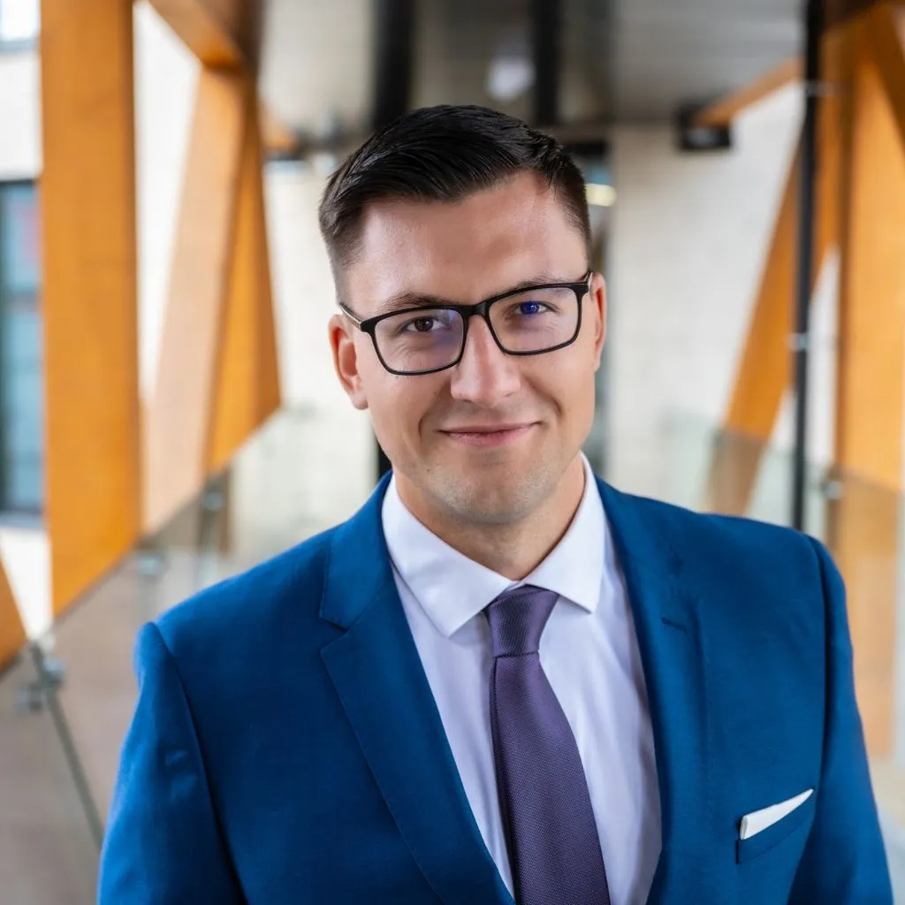
    </gov-grid-item>
    <gov-grid-item size-sm="12/12" size-md="6/12" size-lg="8/12" size-xl="9/12">
      

        <strong>Martin Smetana</strong> má bohaté zkušenosti v oblasti analýzy dat a jejich využití v praxi. Jeho profesní dráha začala na pozici datového analytika, následně vedl oddělení plánování a vyhodnocování kontrol na Nejvyšším kontrolním úřadě (NKÚ). V současné době působí na NKÚ jako ředitel odboru systémové podpory kontrolní činnosti. Tento odbor se zaměřuje na analytickou, metodickou a technickou podporu pro plánování, provádění a vyhodnocování kontrolní činnosti. Martin se také aktivně věnuje sdílení svých znalostí a zkušeností, a proto rád přednáší na různá témata jako je analýza dat, datové vizualizace a data storytellingu.
      

    </gov-grid-item>
</gov-grid>

<gov-grid gutter-x="1rem" gutter-y="1rem">
    <gov-grid-item size-sm="12/12" size-md="6/12" size-lg="4/12" size-xl="3/12">
      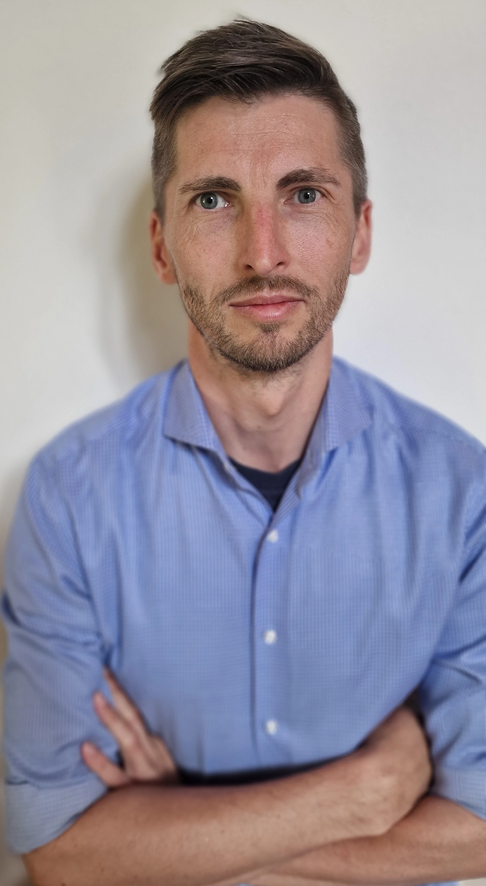
    </gov-grid-item>
    <gov-grid-item size-sm="12/12" size-md="6/12" size-lg="8/12" size-xl="9/12">
      

        <strong>Libor Drlík</strong> je lídrem projektového týmu Digitální a informační agentury zaměřeného na rozvoj kvalitní správy dat a spoluautorem Strategie pro správu dat ve veřejné správě (2024–2030). Zároveň se zabývá enterprise architekturou úřadů a je součástí kompetenčního centra NAKIT pro podporu tvorby informačních koncepcí úřadů. Předchozí profesní zkušenosti v oblastech business analýzy a architektury, procesního řízení a business intelligence získal převážně v bankovním sektoru.
      

    </gov-grid-item>
</gov-grid>

<gov-grid gutter-x="1rem" gutter-y="1rem">
    <gov-grid-item size-sm="12/12" size-md="6/12" size-lg="4/12" size-xl="3/12">
      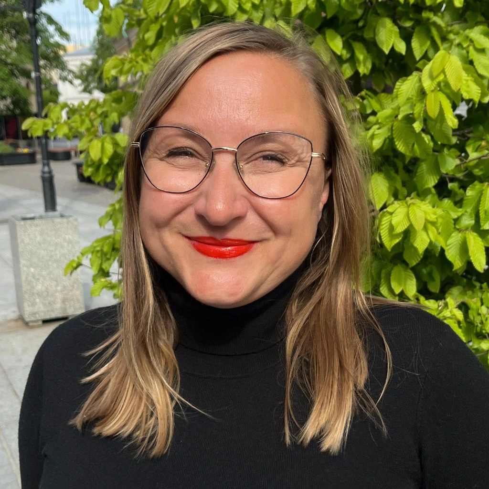
    </gov-grid-item>
    <gov-grid-item size-sm="12/12" size-md="6/12" size-lg="8/12" size-xl="9/12">
      

        <strong>Jitka Faugnerová</strong> je vedoucí oddělení geoinformatiky v České informační agentuře životního prostředí (CENIA). Je národní kontaktní osobou pro směrnici INSPIRE v ČR. Má bohaté zkušenosti s koordinací projektů zaměřených na prostorové informace a jejich technickou implementací. Se svým týmem podporuje poskytovatele prostorových dat ve zpřístupňování, organizuje webináře a konference, v rámci kterých sdílí odborná veřejnost své znalosti a zkušenosti. Aktuálně se podílí na budování Geoportálu ČR.
      

    </gov-grid-item>
</gov-grid>

<gov-grid gutter-x="1rem" gutter-y="1rem">
    <gov-grid-item size-sm="12/12" size-md="6/12" size-lg="4/12" size-xl="3/12">
      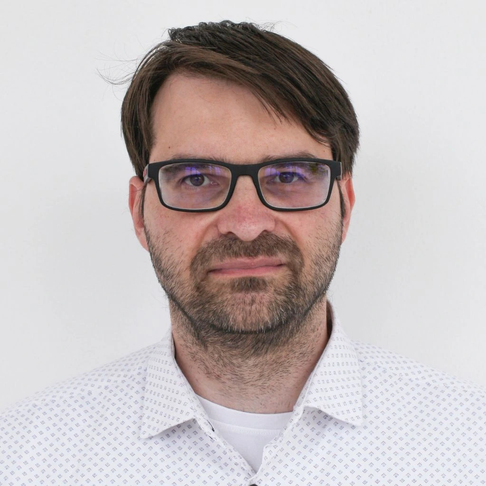
    </gov-grid-item>
    <gov-grid-item size-sm="12/12" size-md="6/12" size-lg="8/12" size-xl="9/12">
      

        <strong>Zbyšek Stodůlka</strong> je metodik v Oddělení digitálního archivu a digitálních služeb Národního archivu s více než patnáctiletou zkušeností v oblasti digitální archivace a správy dokumentů. Je členem pracovní podskupiny „Archiving by Design“ Evropské archivní skupiny při Evropské komisi, Vědecké archivní rady, pracovní skupiny pro správu dat RVIS a dalších odborných grémií. Externě přednáší na Univerzitě Karlově a Masarykově univerzitě.
      

    </gov-grid-item>
</gov-grid>

<gov-grid gutter-x="1rem" gutter-y="1rem">
    <gov-grid-item size-sm="12/12" size-md="6/12" size-lg="4/12" size-xl="3/12">
      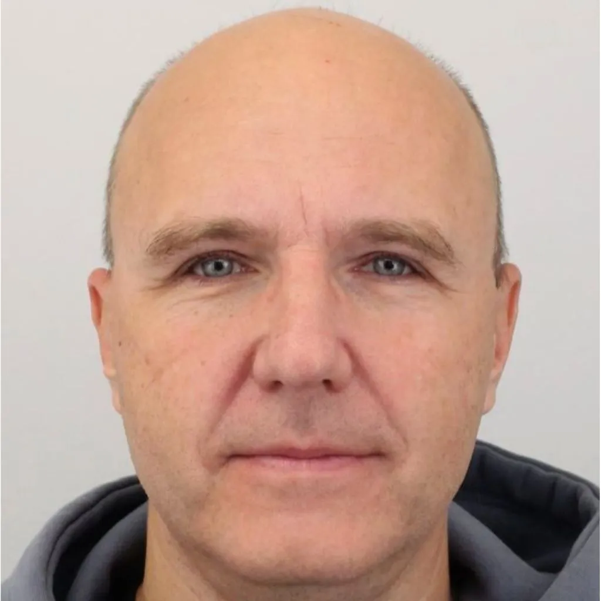
    </gov-grid-item>
    <gov-grid-item size-sm="12/12" size-md="6/12" size-lg="8/12" size-xl="9/12">
      

        <strong>Martin Cepr</strong> pracuje od roku 2024 na odboru Hlavního architekta eGovernmentu, po předchozí kariéře v soukromém sektoru. Podílí se na přípravě podkladů pro Národní architekturu eGovernmentu dostupnou na adrese https://archi.gov.cz. Spolupracuje i na přípravě systému ISDŘ a jeho testování. 
      

    </gov-grid-item>
</gov-grid>

<gov-grid gutter-x="1rem" gutter-y="1rem">
    <gov-grid-item size-sm="12/12" size-md="6/12" size-lg="4/12" size-xl="3/12">
      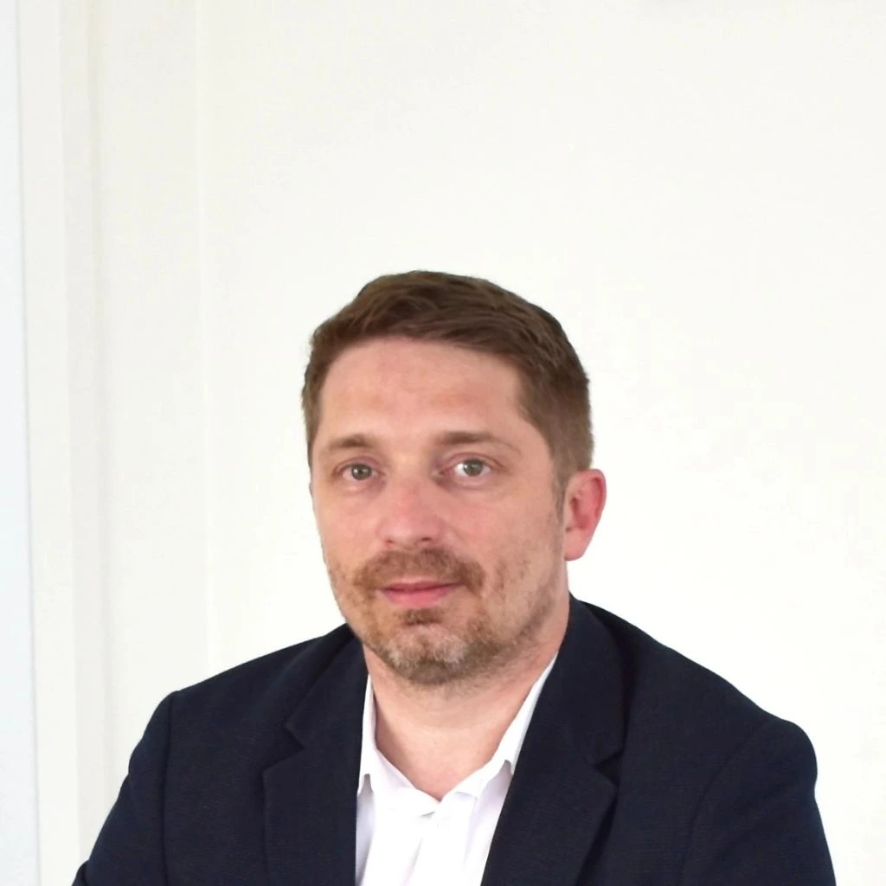
    </gov-grid-item>
    <gov-grid-item size-sm="12/12" size-md="6/12" size-lg="8/12" size-xl="9/12">
      

        <strong>Michal Verner</strong> vystudoval obory Informatika a Mezinárodní a regionální vztahy v průmyslovém vlastnictví. Oba obory propojuje ve své pozici vedoucího oddělení analýz a digitalizace Úřadu průmyslového vlastnictví. S více než 18 lety praxe v oblasti digitalizace, implementace standardů do řízení organizace a mezinárodní spolupráce přispívá k udržování vedoucí pozice Úřadu průmyslového vlastnictví v oblasti digitalizace a kvality služeb nejen v rámci české státní správy, ale i v mezinárodním srovnání.
      

    </gov-grid-item>
</gov-grid>

<gov-grid gutter-x="1rem" gutter-y="1rem">
    <gov-grid-item size-sm="12/12" size-md="6/12" size-lg="4/12" size-xl="3/12">
      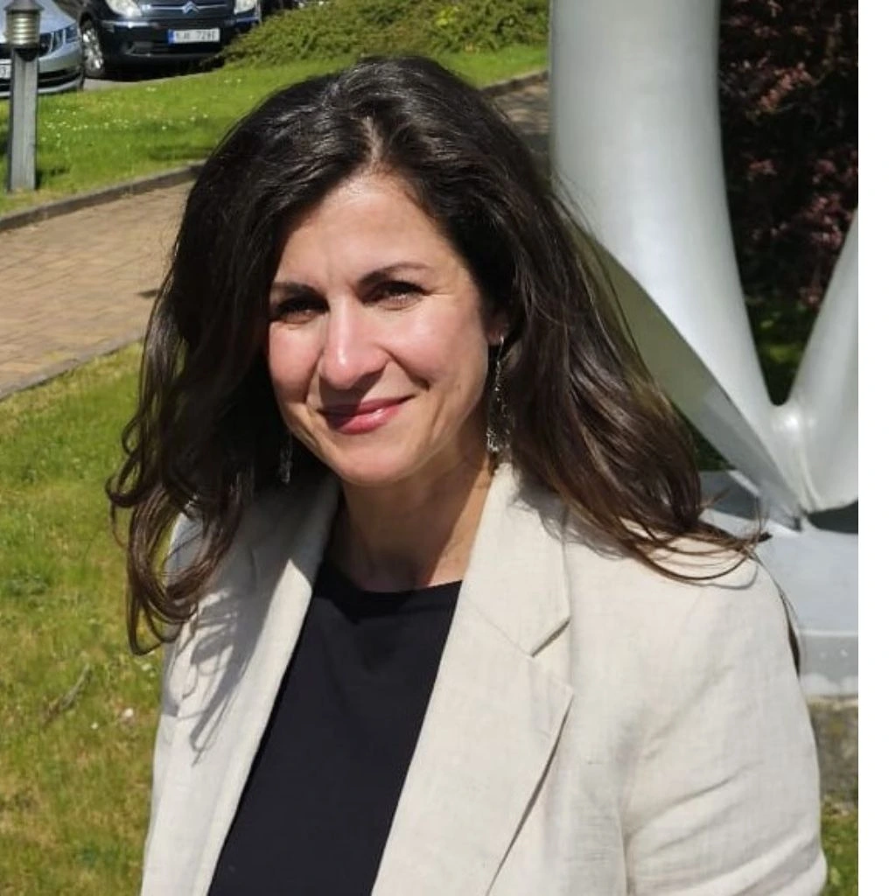
    </gov-grid-item>
    <gov-grid-item size-sm="12/12" size-md="6/12" size-lg="8/12" size-xl="9/12">
      

        <strong>Klára Jiráková</strong> je předsedkyní Expertní skupiny členských států pro elektronické zdravotnictví (eHealth), která se skládá ze zástupců ostatních členských států odpovědných za implementaci a provoz národních kontaktních míst pro elektronické zdravotnictví,  jež společně tvoří přeshraniční služby elektronického zdravotnictví v EU - MyHealth@EU. Pracuje na Ministerstvu zdravotnictví, v Národním centru elektronického zdravotnictví jako právnička a projektová manažerka a je také dlouhodobou zaměstnankyní odboru informatiky Krajského úřadu Kraje Vysočina, kde je zodpovědná mimo jiné za provoz Národního kontaktního místa pro elektronické zdravotnictví.
      

    </gov-grid-item>
</gov-grid>

<gov-grid gutter-x="1rem" gutter-y="1rem">
    <gov-grid-item size-sm="12/12" size-md="6/12" size-lg="4/12" size-xl="3/12">
      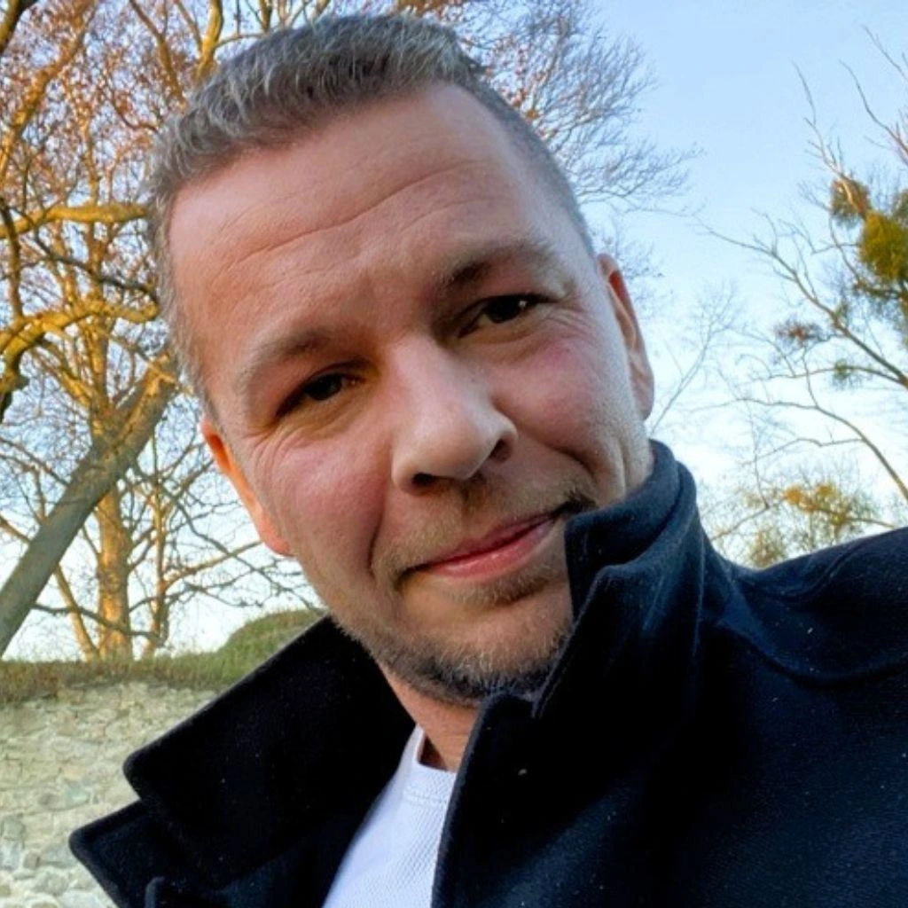
    </gov-grid-item>
    <gov-grid-item size-sm="12/12" size-md="6/12" size-lg="8/12" size-xl="9/12">
      

        <strong>David Hemala</strong> vystudoval obor Informační systémy a technologie na Vysoké škole ekonomické v Praze, kde v současné chvíli participuje při výuce databázových systémů. Aktuálně se podílí na problematice řízeného přístupu a správy dat v Digitální a informační agentuře. Podílel se na projektu otevřených dat v ČR, té doby pod taktovkou Ministerstva vnitra, a spolupracoval při tvorbě řešení projektu SLDB 2021.
      

    </gov-grid-item>
</gov-grid>

<gov-grid gutter-x="1rem" gutter-y="1rem">
    <gov-grid-item size-sm="12/12" size-md="6/12" size-lg="4/12" size-xl="3/12">
      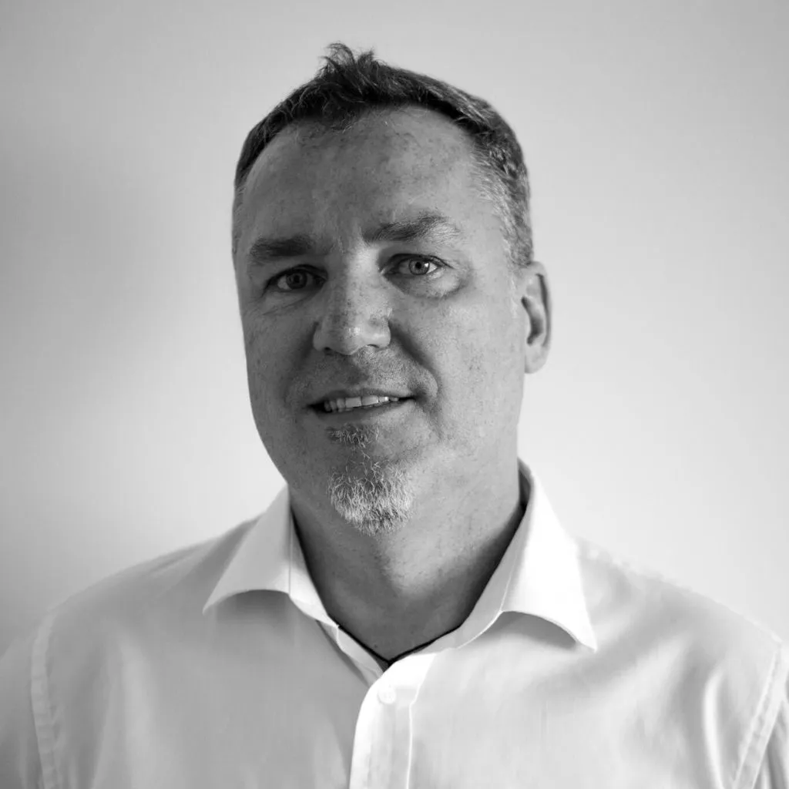
    </gov-grid-item>
    <gov-grid-item size-sm="12/12" size-md="6/12" size-lg="8/12" size-xl="9/12">
      

        <strong>Aleš Tichopád</strong> je specialistou na real-world evidence, docentem a vedoucím výzkumu v týmu CzechHTA na Fakultě biomedicínského inženýrství ČVUT. Jeho specializací je analýza velkých zdravotnických dat pro pochopení efektivity a ekonomiky zdravotnických procesů, včetně aplikace metod HTA. V oblasti HTA a zdravotní ekonomiky působí od roku 2003. Mezi lety 2001 a 2013 se vedle toho, jako doktorand a postdoc na Technické univerzitě Mnichov, věnoval vývoji molekulárně diagnostických metod na principu real-time PCR, zejména pak algoritmům pro práci s daty. Je autorem více než 50 mezinárodních publikací v impaktovaných časopisech, jejichž citovanost přesáhla 5000 citací.
      

    </gov-grid-item>
</gov-grid>

<gov-grid gutter-x="1rem" gutter-y="1rem">
    <gov-grid-item size-sm="12/12" size-md="6/12" size-lg="4/12" size-xl="3/12">
      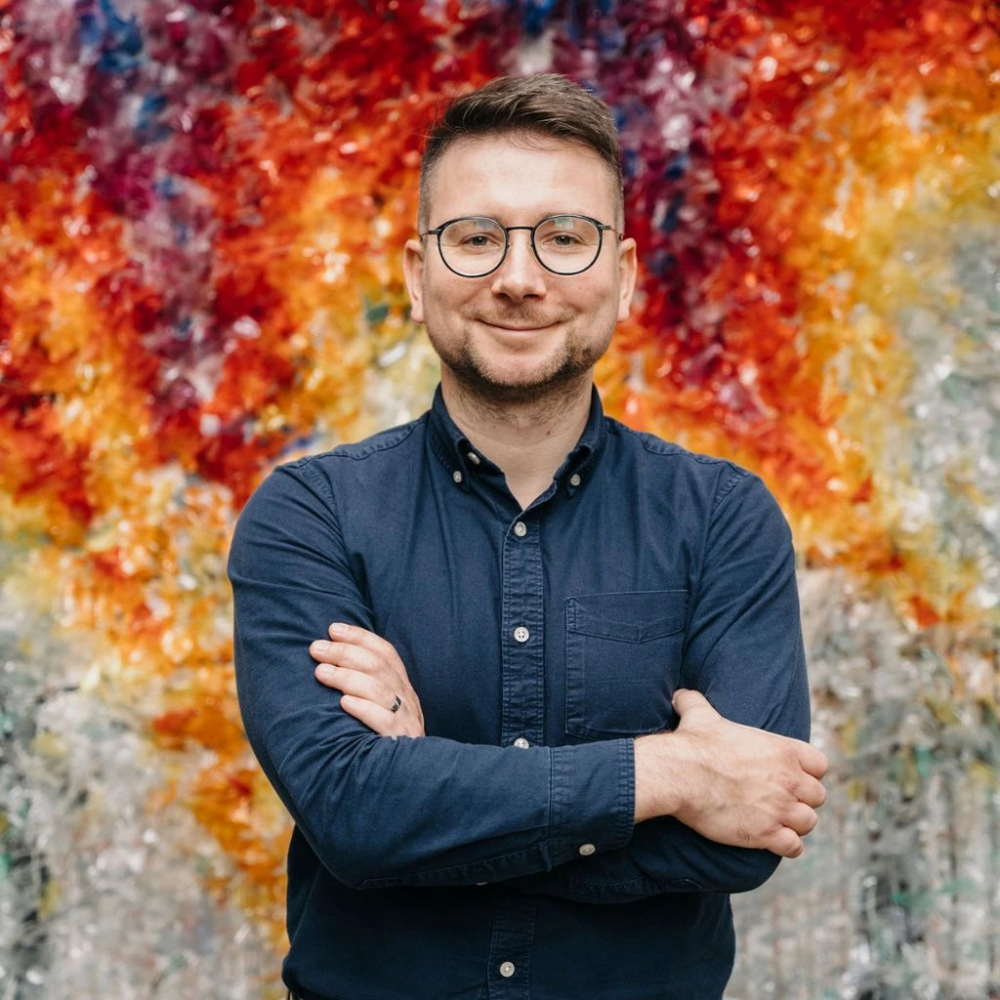
    </gov-grid-item>
    <gov-grid-item size-sm="12/12" size-md="6/12" size-lg="8/12" size-xl="9/12">
      

        <strong>Jiří Marek</strong> působí jako vedoucí Sekretariátu EOSC CZ, kde zajišťuje implementaci Evropského otevřeného vědeckého cloudu v České republice, a současně zastává pozici Open Science Managera na Masarykově univerzitě. Je jedním z iniciátorů Brněnské Open Source deklarace, která usiluje o vytvoření Národního Open Source Program Office pro veřejný sektor a akademii. Vzdělání má v oboru chemie se specializací na vodíkové technologie a v ICT právu se zaměřením na Open Access, Open Agenda a autorské právo. 
      

    </gov-grid-item>
</gov-grid>

<gov-grid gutter-x="1rem" gutter-y="1rem">
    <gov-grid-item size-sm="12/12" size-md="6/12" size-lg="4/12" size-xl="3/12">
      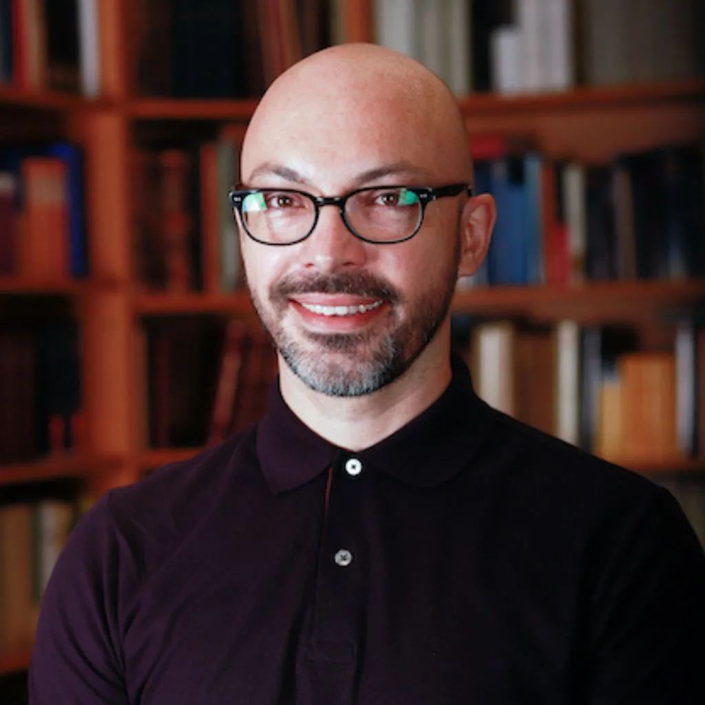
    </gov-grid-item>
    <gov-grid-item size-sm="12/12" size-md="6/12" size-lg="8/12" size-xl="9/12">
      

        <strong>Radim Hladík</strong> je vědecký pracovník Filosofického ústavu AV ČR v Praze. Jeho výzkum se zaměřuje na kvantitativní studium vědy, textovou analytiku, digitální humanitní vědy a vědeckou komunikaci. Působí jako redaktor časopisu Teorie vědy, předseda České asociace pro digitální humanitní vědy a je vývojářem open-source softwaru Requal pro kvalitativní analýzu dat. Doktorát ze sociologie získal na Fakultě sociálních věd Univerzity Karlovy a absolvoval zahraniční výzkumné pobyty v USA (Columbia University) a Japonsku (National Institute of Informatics).
      

    </gov-grid-item>
</gov-grid>

<gov-grid gutter-x="1rem" gutter-y="1rem">
    <gov-grid-item size-sm="12/12" size-md="6/12" size-lg="4/12" size-xl="3/12">
      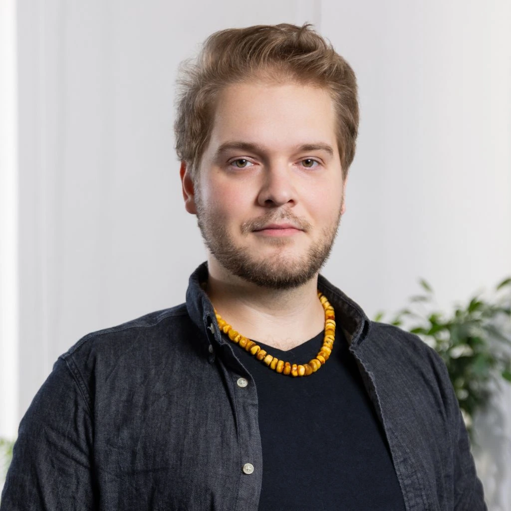
    </gov-grid-item>
    <gov-grid-item size-sm="12/12" size-md="6/12" size-lg="8/12" size-xl="9/12">
      

        <strong>Jiří Münich </strong> (1993) vystudoval interdisciplinární společenské vědy a statistiku pro psychologický výzkum na University of Amsterdam. Několik let působil jako datový analytik a evaluátor v neziskovém a státním sektoru v oblastech vzdělávací a sociální politiky. Momentálně pracuje v PAQ Research, kde se věnuje otázkám nerovností ve vzdělávání a dostupnosti veřejných služeb v regionech.
      

    </gov-grid-item>
</gov-grid>

<gov-grid gutter-x="1rem" gutter-y="1rem">
    <gov-grid-item size-sm="12/12" size-md="6/12" size-lg="4/12" size-xl="3/12">
      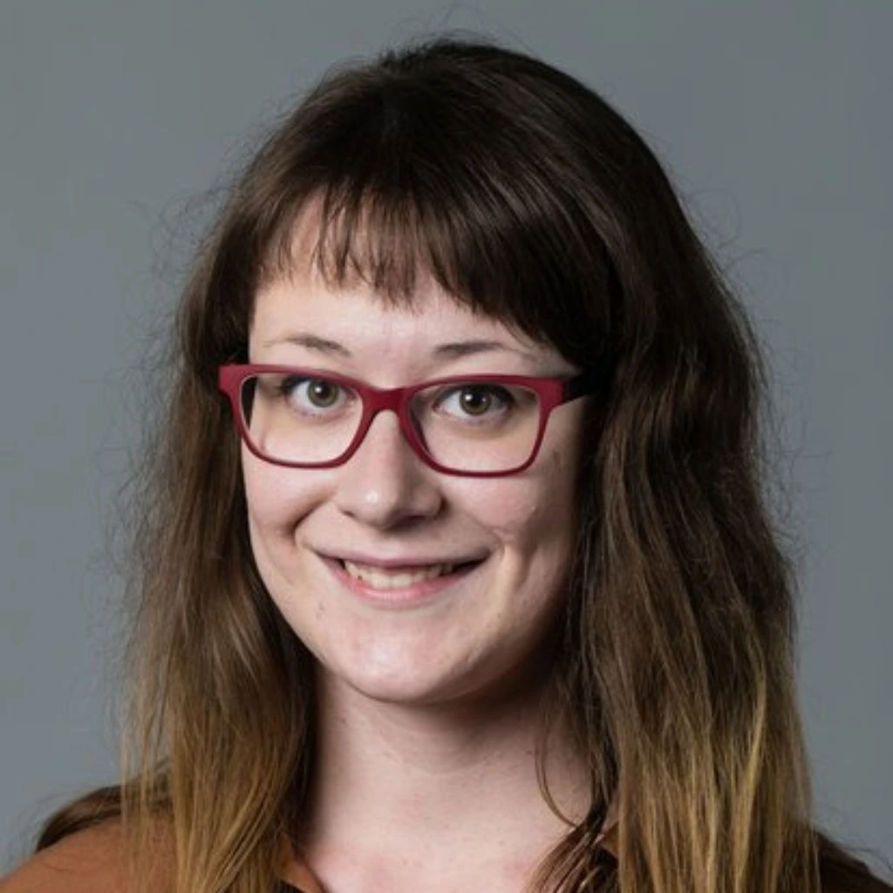
    </gov-grid-item>
    <gov-grid-item size-sm="12/12" size-md="6/12" size-lg="8/12" size-xl="9/12">
      

        <strong>Kristýna Zaklová</strong> je absolventkou Fakulty informačních technologií VUT v Brně, kde od roku 2023 pokračuje v doktorském studiu. Zaměřuje se na otevřená (vládní) data, jejich zpracování a vizualizace. Dále je zakladatelkou projektu Zastupko.cz, který analyzuje a zpřístupňuje hlasování městských a krajských zastupitelstev. Cílem tohoto projektu je zvýšit transparentnost rozhodování samospráv a umožnit občanům snadno sledovat, jak jejich zástupci hlasují. Mezi její další iniciativy patří např. projekt Komu patřím, který umožňuje jednotné prohledávání dostupných registrů psů a koček.
      

    </gov-grid-item>
</gov-grid>

<gov-grid gutter-x="1rem" gutter-y="1rem">
    <gov-grid-item size-sm="12/12" size-md="6/12" size-lg="4/12" size-xl="3/12">
      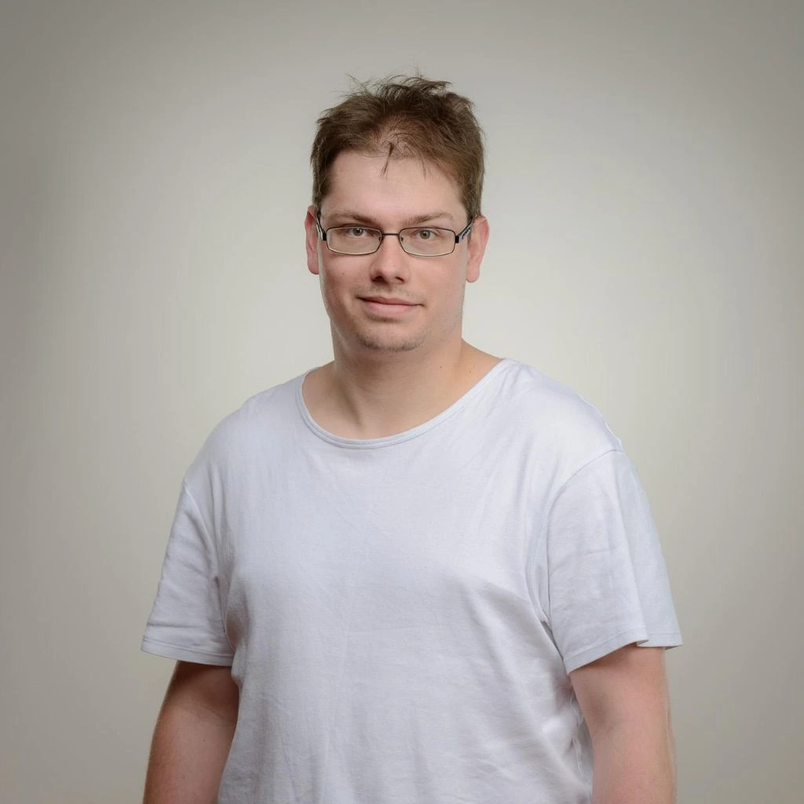
    </gov-grid-item>
    <gov-grid-item size-sm="12/12" size-md="6/12" size-lg="8/12" size-xl="9/12">
      

        <strong>Jan Cibulka</strong> je datový novinář Českého rozhlasu, specializuje se na prostorové informace, digitální technologie a transparentnost veřejné správy.
      

    </gov-grid-item>
</gov-grid>

<gov-grid gutter-x="1rem" gutter-y="1rem">
    <gov-grid-item size-sm="12/12" size-md="6/12" size-lg="4/12" size-xl="3/12">
      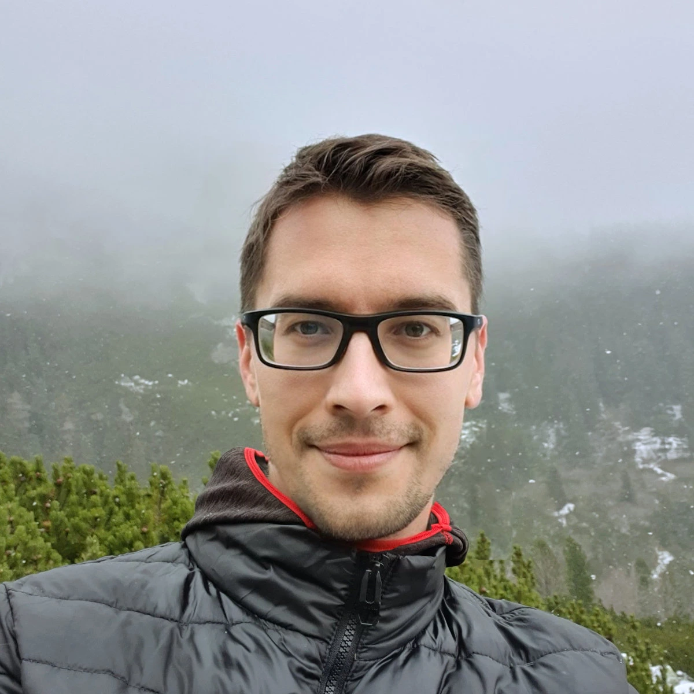
    </gov-grid-item>
    <gov-grid-item size-sm="12/12" size-md="6/12" size-lg="8/12" size-xl="9/12">
      

        <strong>Jáchym Brzezina</strong> více než 10 let působí na Českém hydrometeorologickém ústavu, posledních 7 let jako vedoucí oddělení kvality ovzduší v Brně. Pracovně i ve volném čase se věnuje mimo jiné datové analýze, datové vizualizaci, popularizaci oborů souvisejících s životním prostředím a vývoji webových stránek. Je autorem například vzdělávacího webu infoviz.cz se stovkami infografik a analytického webu envidata.cz, který nabízí rozsáhlé analýzy založené na volně dostupných datech o počasí a klimatu, vodě, kvalitě ovzduší a odpadech.
      

    </gov-grid-item>
</gov-grid>

<gov-grid gutter-x="1rem" gutter-y="1rem">
    <gov-grid-item size-sm="12/12" size-md="6/12" size-lg="4/12" size-xl="3/12">
      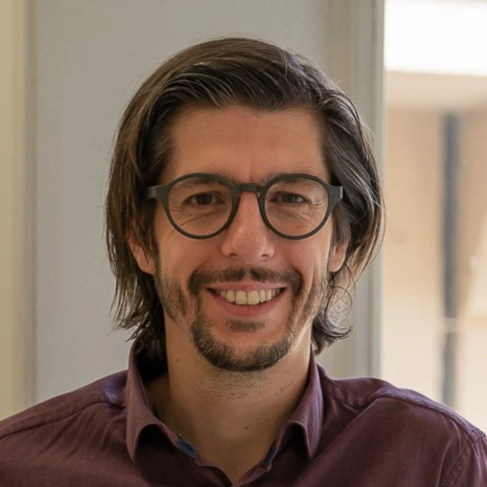
    </gov-grid-item>
    <gov-grid-item size-sm="12/12" size-md="6/12" size-lg="8/12" size-xl="9/12">
      

        <strong>Radek Hábl</strong> je absolventem VŠE v Praze.12 let působil na různých finančních pozicích v soukromé sféře. V roce 2014 se přesunul do neziskové oblasti a o tři roky později realizoval projekt Mapa exekucí. V roce 2019 s kolegy založil Institut prevence a řešení předlužení, který se zaměřuje na problematiku zadluženosti domácností. Je členem Rady vlády pro lidská práva a celosvětové sítě sociálních inovátorů Ashoka Fellows Network. Byl odborným poradcem a průvodcem úspěšného dokumentárního seriálu České televize „V exekuci“.
      

    </gov-grid-item>
</gov-grid>

<gov-grid gutter-x="1rem" gutter-y="1rem">
    <gov-grid-item size-sm="12/12" size-md="6/12" size-lg="4/12" size-xl="3/12">
      
    </gov-grid-item>
    <gov-grid-item size-sm="12/12" size-md="6/12" size-lg="8/12" size-xl="9/12">
      

        <strong>Kristína Pšorn Zákopčanová</strong> kreslí grafy, datové vizualizace a mapy. Jako designérka vizuální komunikace dat pomáhá odborníkům, vědcům i novinářům převádět složité informace do srozumitelných vizualizací a příběhů. Dlouhodobě spolupracuje s projektem Fakta o klimatu, který prostřednictvím vizualizace dat a vlastní analytické práce usiluje o lepší porozumění klimatické změně a možnostem jejího řešení v Česku. Je také součástí projektu Samizdat, kde tvoří datové články pro zpravodajství – za vizualizaci statistik úmrtí získal tým Novinářskou cenu. Na volné noze se věnuje konzultacím a školení v oblasti datové vizualizace a designového přemýšlení nad daty.
      

    </gov-grid-item>
</gov-grid>

