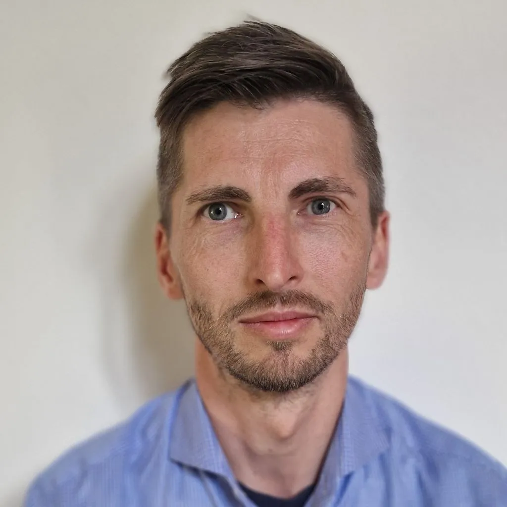



Zúčastněte se 9. ročníku konference **Jak na data ve veřejné správě** o využívání a správě dat státní správy a samosprávy!

- **Kdy?** 3. června 2025, 9:00 - 16:00
- **Kde?** Akademie veřejného investování MMR, Pařížská 4, 110 00 Praha a online
- **Registrace:** Vyplňte prosím [formulář](https://forms.office.com/e/nDnu1P51B3?origin=lprLink). Kapacita sálu je omezená. Je možné, že bude rychle naplněna. V tom případě Vás budeme informovat. Konferenci můžete sledovat i online na YouTube!
- **Online přenos:** Bude doplněno

Veřejná správa disponuje velkým potenciálem v podobě datových zdrojů, které spravuje. 
Pro jejich efektivní využití je však nutné do této oblasti systematicky investovat - nejen finance, ale i čas a úsilí. 
Klíčová je podpora kvality dat, propracovaného data managementu a v neposlední řadě také do vzdělávání úředníků i dalších zainteresovaných stran. Letošní konference se zaměří na efektivní správu dat, jejich sdílení, zajištění vysoké datové kvality a konkrétních příkladů užití dat a to nejen otevřených.

## Program
* Loňský ročník si můžete připomenout na našem [YouTube](https://www.youtube.com/live/zqkCNgZejmo). 

* 08:30 - 09:00 **REGISTRACE**

* 09:00 - 10:05 **ÚVODNÍ BLOK - TRENDY V DATECH VEŘEJNÉHO SEKTORU**
  * **Zahájení konference a úvodní slovo** Martin Mesršmíd, Digitální a informační agentura
  * **Key note speech (in English)** Martin Skovbjerg Jensen, Dánská agentura pro digitální vládnutí 
  * **Key note speech** Martin Nečaský, Matematicko-fyzikální faktulta UK

* 10:05 - 11:45 **BLOK I - SPRÁVA DAT**
  * **Naplňování minimálního standardu a jak si stojíme** Libor Drlík, Digitální a informační agentura
  * **Geoportál ČR - jednotný přístup k prostorovým  datům** Jitka Faugnerová, CENIA
  * Zbyšek Stodůlka, Národní archiv
  * **Datové standardy - tvorba Záznamu informačního systému nahrazujícího úředně ověřený podpis** Martin Cepr, Digitální a informační agentura
  * Michal Verner, Úřad průmyslového vlastnictví
  * Klára Jiráková, Kraj Vysočina

* 11:45 - 12:30 **OBĚD**

* 12:30 - 14:00 **BLOK II - VEŘEJNÁ DATA A VĚDA**               
  * **Řízený přístup k datům** David Hemala, Digitální a informační agentura
  * **Kde je rovnováha mezi benefity a riziky využití zdravotnických dat** Aleš Tichopád, Fakultě biomedicínského inženýrství ČVUT
  * EOSC
  * **Využití veřejných dat pro výzkumné účely z perspektivy uživatele** Radim Hladík, Akademie věd ČR
  * Jiří Münich, PAQ Research

* 14:00 - 14:30 **COFFEE BREAK**

* 14:30 - 16:00 **BLOK III - OTEVŘENÁ DATA A JEJICH VYUŽITÍ**
  * **Zastupko.cz: transparentnost v rozhodování samospráv** Kristýna Zaklová, Zastupko
  * Jan Cibulka, Český rozhlas
  * **Jaká data o životním prostředí máme dnes volně k dispozici, co s nimi můžeme dělat a k čemu nám jsou?** Jáchym Brzezina, Envidata
  * Radek Hábl, Institut prevence a řešení předlužení
  * Kristýna Pšorn Zákopčanová

* 10:05 - 11:05 **WORKSHOP - Vizualizace dat** Martin Smetana, Václav Flaška, Kristýna Pulpán, Nejvyšší kontrolní úřad - pro velký úspěch jde o opakování workshopu z roku 2024
* 12:30 - 13:15 **DISCUSSION with the representative of the Danish Agency for Digital Government (in English)** Martin Skovbjerg Jensen, Dánska agentura pro digitální vládnutí                  

## Na konferenci vystoupí
<gov-grid gutter-x="1rem" gutter-y="1rem">
    <gov-grid-item size-sm="12/12" size-md="6/12" size-lg="4/12" size-xl="3/12">
      
    </gov-grid-item>
    <gov-grid-item size-sm="12/12" size-md="6/12" size-lg="8/12" size-xl="9/12">
      

        <strong>Martin Mesršmíd</strong> vystudoval informační management na pražské Vysoké škole ekonomické. Mezi roky 2005 a 2010 působil v Seznam.cz, kde měl jako manažer na starosti portál Sprace.cz, zaměřený na pracovní příležitosti. Od září 2010 do května 2013 pracoval v Economii, kde řídil oddělení zodpovědné za elektronickou distribuci obsahu. Od června 2013 pracoval zejména pro Avast, zhruba rok se věnoval vedení týmu zaměřeného na zkoumání dat, poté vystřídal několik pozic v divizi Jumpshot. Od 1.2. 2023 je ředitelem Digitální a informační agentury.
      

    </gov-grid-item>
</gov-grid>

<gov-grid gutter-x="1rem" gutter-y="1rem">
    <gov-grid-item size-sm="12/12" size-md="6/12" size-lg="4/12" size-xl="3/12">
      
    </gov-grid-item>
    <gov-grid-item size-sm="12/12" size-md="6/12" size-lg="8/12" size-xl="9/12">
      

        <strong>Libor Drlík</strong> je lídrem projektového týmu Digitální a informační agentury zaměřeného na rozvoj kvalitní správy dat a spoluautorem Strategie pro správu dat ve veřejné správě (2024–2030). Zároveň se zabývá enterprise architekturou úřadů a je součástí kompetenčního centra NAKIT pro podporu tvorby informačních koncepcí úřadů. Předchozí profesní zkušenosti v oblastech business analýzy a architektury, procesního řízení a business intelligence získal převážně v bankovním sektoru.
      

    </gov-grid-item>
</gov-grid>

<gov-grid gutter-x="1rem" gutter-y="1rem">
    <gov-grid-item size-sm="12/12" size-md="6/12" size-lg="4/12" size-xl="3/12">
      
    </gov-grid-item>
    <gov-grid-item size-sm="12/12" size-md="6/12" size-lg="8/12" size-xl="9/12">
      

        <strong>Martin Smetana</strong> má bohaté zkušenosti v oblasti analýzy dat a jejich využití v praxi. Jeho profesní dráha začala na pozici datového analytika, následně vedl oddělení plánování a vyhodnocování kontrol na Nejvyšším kontrolním úřadě (NKÚ). V současné době působí na NKÚ jako ředitel odboru systémové podpory kontrolní činnosti. Tento odbor se zaměřuje na analytickou, metodickou a technickou podporu pro plánování, provádění a vyhodnocování kontrolní činnosti. Martin se také aktivně věnuje sdílení svých znalostí a zkušeností, a proto rád přednáší na různá témata jako je analýza dat, datové vizualizace a data storytellingu.
      

    </gov-grid-item>
</gov-grid>

<gov-grid gutter-x="1rem" gutter-y="1rem">
    <gov-grid-item size-sm="12/12" size-md="6/12" size-lg="4/12" size-xl="3/12">
      
    </gov-grid-item>
    <gov-grid-item size-sm="12/12" size-md="6/12" size-lg="8/12" size-xl="9/12">
      

        <strong>Martin Nečaský</strong> působí v oblasti otevřených dat od roku 2011, kdy založil iniciativu OpenData.cz. Od té doby realizoval řadu projektů, ve kterých pomáhal úřadům s otevíráním jejich dat (např. ČTÚ, ČSSZ, MFČR, NKÚ). V současnosti působí jako docent na Matematicko-fyzikální fakultě Univerzity Karlovy v oboru informatika a také jako odborný vedoucí týmu Národního koordinátora otevřených dat na Ministerstvu vnitra ČR, kde pomáhá českým úřadům s publikací otevřených dat a podílí se na tvorbě pravidel, standardů, doporučení a legislativy v oblasti otevřených dat. V oblasti otevřených dat též publikuje v uznávaných mezinárodních vědeckých časopisech jako je např. Semantic Web Journal nebo Journal of Web Semantics.
      

    </gov-grid-item>
</gov-grid>

<gov-grid gutter-x="1rem" gutter-y="1rem">
    <gov-grid-item size-sm="12/12" size-md="6/12" size-lg="4/12" size-xl="3/12">
      
    </gov-grid-item>
    <gov-grid-item size-sm="12/12" size-md="6/12" size-lg="8/12" size-xl="9/12">
      

        <strong>Radim Hladík</strong> je vědecký pracovník Filosofického ústavu AV ČR v Praze. Jeho výzkum se zaměřuje na kvantitativní studium vědy, textovou analytiku, digitální humanitní vědy a vědeckou komunikaci. Působí jako redaktor časopisu Teorie vědy, předseda České asociace pro digitální humanitní vědy a je vývojářem open-source softwaru Requal pro kvalitativní analýzu dat. Doktorát ze sociologie získal na Fakultě sociálních věd Univerzity Karlovy a absolvoval zahraniční výzkumné pobyty v USA (Columbia University) a Japonsku (National Institute of Informatics).
      

    </gov-grid-item>
</gov-grid>

<gov-grid gutter-x="1rem" gutter-y="1rem">
    <gov-grid-item size-sm="12/12" size-md="6/12" size-lg="4/12" size-xl="3/12">
      
    </gov-grid-item>
    <gov-grid-item size-sm="12/12" size-md="6/12" size-lg="8/12" size-xl="9/12">
      

        <strong>Aleš Tichopád</strong> je specialistou na real-world evidence, docentem a vedoucím výzkumu v týmu CzechHTA na Fakultě biomedicínského inženýrství ČVUT. Jeho specializací je analýza velkých zdravotnických dat pro pochopení efektivity a ekonomiky zdravotnických procesů, včetně aplikace metod HTA. V oblasti HTA a zdravotní ekonomiky působí od roku 2003. Mezi lety 2001 a 2013 se vedle toho, jako doktorand a postdoc na Technické univerzitě Mnichov, věnoval vývoji molekulárně diagnostických metod na principu real-time PCR, zejména pak algoritmům pro práci s daty. Je autorem více než 50 mezinárodních publikací v impaktovaných časopisech, jejichž citovanost přesáhla 5000 citací.
      

    </gov-grid-item>
</gov-grid>

## Dále vystoupí
* Martin Skovbjerg Jensen, Dánská agentura pro digitální vládnutí
* Jitka Faugnerová, Česká agentura životního prostředí
* Radek Hábl, Institut prevence a řešení předlužení
* Jan Cibulka, Samizdat, Český rozhlas
* Klára Jiráková, Kraj Vysočina
* Michal Verner, Úřad průmyslového vlastnictví
* Zbyšek Stodůlka, Národní archiv
* Kristýna Zaklová, Zastupko
* Martin Cepr, Digitální a informační agentura
* Kristýna Pšorn Zákopčanová
* Jiří Münich, PAQ Research
* A další...
